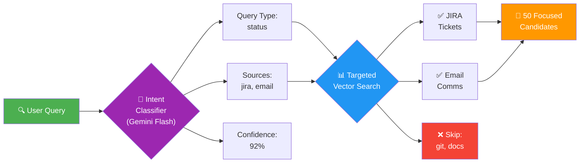
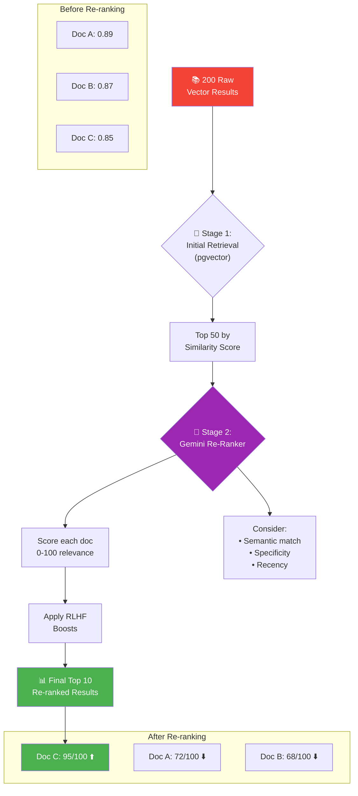
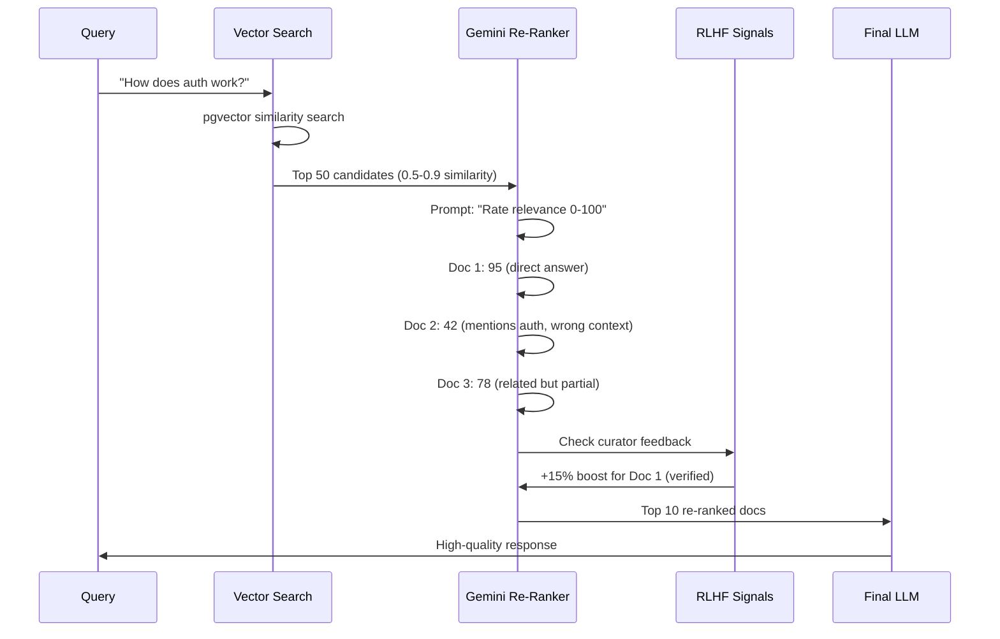
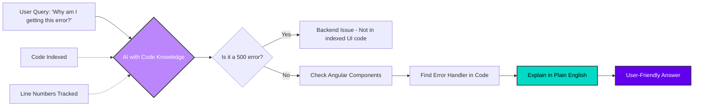
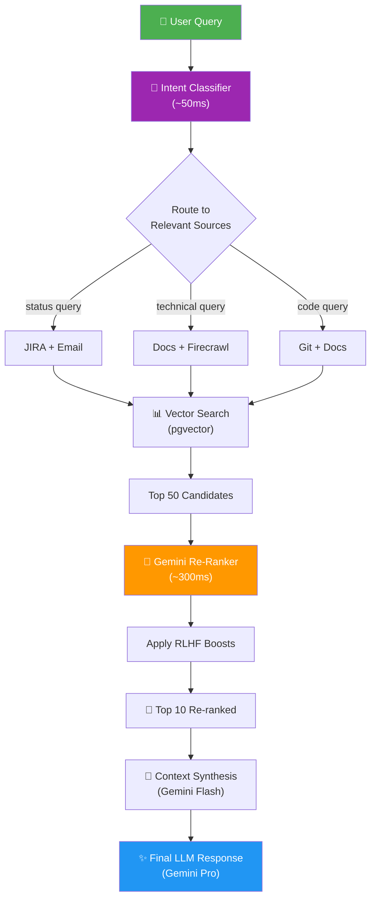

# THE BETABASE DEMO - Production Script

---

## 📹 OPENING (0:00-0:45)

### Voiceover:

> "Most QA platforms keep humans and AI in separate lanes. We asked a different question: **What if they learned from each other?**
>
> I'm Mattie, and this is The Betabase—where human insight trains AI, and AI handles the repetitive work, so humans can focus on what actually requires judgment.
>
> Three pillars: **Chat** for knowledge, **Curate** for continuous improvement, and **Test** for self-healing infrastructure. Each one feeds the others. Let's dive in." 

### Foundation Demo - Multi-Tenant Architecture

*[Show clean chat interface]*

### What to DO:

**Warm-up (optional):**
- Ask technical question: "On a DDP, how many bytes per sector, and what's the max track count?"
- Show it knows deep technical specs
- *Cut this if running long - just visual proof of knowledge depth*

**The Foundation:**
1. **Type:** "Explain The Betabase's multi-tenant database architecture"
2. AI explains (Organization → Division → App isolation)
3. **You say:** "I'm demoing this right now—create an infographic of that multi-tenant architecture for my colleagues. Thanks!"
4. 🍌 **Nano Banana spinner** appears (30-50 sec, you'll cut to ~5 sec in edit)
5. **Gorgeous ERD infographic appears** - Sony Music, SMEJ, Other Music

### What to SAY (while Nano Banana generates):

> "Here's the thing: this isn't built for just us. **Multi-tenant from the ground up**—any organization can use it, totally isolated data. Sony Music here, SMEJ over there, completely separate.
>
> And watch this... *[gesture at spinner]* ...the system is literally creating its own demo slide right now. That's Gemini image generation in real-time. Meta, right?"

**The Insight:** *"Most platforms bolt on multi-tenancy later. We designed isolation into the foundation. That's the difference between a feature and architecture."*

---

## 📹 PILLAR 1: CHAT - Intelligent Retrieval (0:45-2:30)

### What to DO:

**The Question:**
- **Type:** "What are the steps to link a product to a master in AOMA?"

**While It Processes (point to screen):**
- *"Notice the progress—**intent classification** at the top, **re-ranking** at the bottom."*

**When Response Streams:**
- *"Streaming is instant now—Gemini 3 Flash just dropped Wednesday. Three times faster than the previous model."*

### The Diagram Moment:

**Ask:** "How do I upload and archive digital assets in AOMA from preparation to storage?"

**When diagram offer appears:**
- Click "Would you like a visual diagram?"
- 🍌 **Nano Banana generates** (30-50 sec, edit to ~5 sec)
- **5-phase workflow appears**

### What to SAY:

> "Here's what makes this different: **two-stage retrieval**. 
>
> First pass: vector search pulls 200 candidates. Second pass: Gemini re-ranks them by actual relevance, not just embedding similarity. 
>
> **The insight:** Semantic similarity doesn't always mean useful. A document can match your keywords perfectly and still be the wrong answer. Re-ranking fixes that."

**Catchphrase:** *"Most RAG systems stop at similarity. We optimize for usefulness."*
- **Type this exact question**: 
  ```
  How do I upload and archive digital assets in AOMA from preparation to storage?
  ```
- AI responds with detailed workflow explanation
- **Wait for subtle prompt**: "Would you like a visual diagram of this workflow?"
- **Click the prompt** → 30-50 second Nano Banana generation (progress indicator)
- **Beautiful hand-drawn workflow diagram appears**:
  - 📋 Preparation Phase (file selection, validation)
  - 📝 Registration Phase (metadata, ISRC codes)
  - ⬆️ Upload Phase (Aspera, Sony Ci, direct)
  - ⚙️ Processing Phase (transcode, QC)
  - 💾 Archive Phase (S3 Glacier, Master Vault)
- Zoom/pan to show interactivity (might not work)
- Download button works! *just tell that to the user*

> **Technical Note**: Diagram is stored in `ai-sdk-chat-panel.tsx` function `generateFallbackDiagram()`. Triggers when response contains "upload" AND "archive".

### Key Stats to Mention:
- **45,399 vectors** of domain knowledge
- **Intent classification** routes queries intelligently
- **Re-ranking** optimizes for usefulness, not just similarity
- **Nano Banana** creates visuals on-demand (30-50 sec)

### CapCut Overlays:
- "45,399 Vectors" badge (appears when you mention it)
- "Intent → Vector Search → Re-Rank" pipeline diagram (subtle overlay)


### Transition to Curation:

**What to DO:**
- Click **thumbs down** on a response
- Dialog appears: "Thank you for your feedback"
- Type issue: *"Should mention the 2024 spec updates"*
- Click **"Go to Curation Queue"**
- Auto-switches to Curate tab → your feedback is already there

---

## 📹 PILLAR 2: CURATE - Human-in-the-Loop Learning (2:30-3:45)

### What to DO:
1. Already on Curate tab (from transition)
2. Show the feedback you just submitted in the queue
3. Point to other feedback items
4. Show the **accuracy chart** 

### What to SAY:

> "This is where the magic happens. Every thumbs down becomes training data.
>
> Our domain experts—people who actually use AOMA every day—curate the AI's knowledge. They don't just report errors; they **teach the system what better looks like.**
>
> That feedback updates the embeddings, changes what gets surfaced in searches, makes the next answer more accurate."

**The Insight:** *"AI without human feedback is just expensive autocomplete. The curation loop is what makes it actually learn."*

**Catchphrase:** *"We're not building a static knowledge base. We're building one that gets smarter every single day."*

### CapCut Overlays
- "RLHF Feedback Loop" title
- Green checkmark on submit
- Arrow showing chart update

*(Optional mention: "We also have semantic deduplication to keep the knowledge base clean—85% similarity threshold")*

---

## 📹 PILLAR 3: TEST - Self-Healing Infrastructure (3:45-5:15)

### What to DO:
1. Click "Test" tab
2. Show dashboard: **12,177 executions**, **80.4% pass rate**, **12 auto-healed today**
3. Scroll to show: **241 awaiting human review**

### What to SAY:

> "Here's the problem every QA team faces: **you change one button ID, and 50 tests break.** That's your blast radius.
>
> Traditional approach? A QA engineer spends three hours updating selectors manually. We asked: what if AI could handle the obvious ones?
>
> **Three tiers of confidence:**
>
> - **Tier 1** (90%+ confidence): Button renamed but same location, same function? Auto-heal immediately. **12 fixed today**.
>
> - **Tier 2** (70-90%): Button moved to a new container? AI proposes the fix but asks a human to verify. **241 in the queue** right now.
>
> - **Tier 3** (<70%): Complex structural change? Escalate to an architect. AI knows when it's out of its depth.

**The Insight:** *"The goal isn't to replace QA engineers. It's to let them do what humans are actually good at—judgment calls—instead of mechanical selector updates."*

**Catchphrase:** *"Confidence-based automation. AI handles certainty. Humans handle nuance."*

### CapCut Overlays
- Stats appearing one by one
- "94.2% Success" highlight
- Color-code tiers (green/yellow/red)
- Before/after arrows on code diff

*(No Gemini slides needed - this is live demo only)*

---

## 📹 CLOSING: The Loop (5:15-5:45)

### What to DO:
- Return to Chat tab
- Gesture broadly at the interface

### What to SAY:

> "Three pillars, one system:
>
> **Chat** surfaces knowledge. **Curate** improves that knowledge with human expertise. **Test** applies those same learning principles to infrastructure.
>
> The beauty? They feed each other. Better curation means better retrieval. Better tests mean fewer interruptions. Fewer interruptions mean more time to curate.
>
> It's not about replacing humans with AI. It's about **letting each do what they're best at**, and learning from each other along the way."

**Final line:** *"That's The Betabase. Questions?"*

*(Smile, pause, fade to logo)*

### CapCut Overlays
- Three checkmarks appearing
- Final stats overlay
- CTA: "Try thebetabase.com"

*(Closing shot - just your face or return to chat tab)*

---

## 🎤 DEMO QUERIES (Exact Text)

Pre-warm these before recording:

```
Show me The Betabase multi-tenant database architecture
```

```
What are the steps to link a product to a master in AOMA?
```

```
How do I upload and archive digital assets in AOMA from preparation to storage?
```

Then for recording:

```
What are the steps to link a product to a master in AOMA?
```

```
How do I upload and archive digital assets in AOMA from preparation to storage?
```
⬆️ **This triggers the beautiful 5-phase workflow diagram!** Click the "Would you like a visual diagram?" prompt that appears.

```
What new features are in AOMA 2.116.0?
```

---

## 🎨 CAPCUT EDITING CHECKLIST

### Import & Organize
- [ ] Import screen recording(s)
- [ ] Trim dead space between actions
- [ ] Mark shot boundaries (5 main shots)

### Text Overlays
- [ ] Add stats overlays (45,399 vectors, 94.2%, etc.)
- [ ] Add pillar titles (Chat / Curate / Test)
- [ ] Add key phrases at transitions

### Visual Enhancements
- [ ] Zoom 1.5-2x on key UI elements
- [ ] Circle/highlight citations, buttons
- [ ] Add color coding (green for success, yellow for review)
- [ ] Pan across stats grid

### Audio
- [ ] Add subtle background music (-20dB)
- [ ] Ensure voiceover is clear
- [ ] Remove long pauses/silence

### Export
- [ ] Resolution: 1080p minimum
- [ ] Frame rate: 30fps
- [ ] Format: H.264 MP4
- [ ] Bitrate: 10-15 Mbps

---

## 📊 VISUAL ASSETS (Post-Production Only)

*(These Gemini slide prompts are for AFTER recording if you want B-roll. NOT needed during live demo.)*

**Skip this section during recording - Nano Banana generates everything live!**

---

## ⏱️ TIMING BREAKDOWN

| Shot | Time | Pillar | Key Moment |
|------|------|--------|------------|
| 1 | 0:00-0:30 | Intro | Multi-tenant ERD |
| 2 | 0:30-2:00 | Chat | Query + diagram |
| 3 | 2:00-3:30 | Curate | Feedback + queue |
| 4 | 3:30-5:00 | Test | Self-healing workflow |
| 5 | 5:00-5:30 | Close | Three pillars summary |

---

## 🔧 PRE-RECORDING CHECKLIST

### Environment
- [ ] Dev server: `cd ~/Documents/projects/mc-thebetabase && pnpm dev`
- [ ] URL: http://localhost:3000
- [ ] Auth bypass: `NEXT_PUBLIC_BYPASS_AUTH=true` in .env.local
- [ ] No console errors (check DevTools)

### Pre-Cache Queries
Run these before recording (warms cache):
- [ ] "Show me The Betabase multi-tenant database architecture"
- [ ] "What are the steps to link a product to a master in AOMA?"
- [ ] "How do I upload and archive digital assets in AOMA from preparation to storage?" ⭐ (triggers diagram)
- [ ] "What new features are in AOMA 2.116.0?"

### UI Check
- [ ] Navigate to Test tab (loads data)
- [ ] Navigate to Curate tab (loads data)
- [ ] Return to Chat tab
- [ ] All tabs render without errors

### Recording Setup
- [ ] Screen resolution: 1920x1080 or higher
- [ ] Browser fullscreen mode
- [ ] Hide bookmarks bar
- [ ] Close DevTools
- [ ] CapCut ready for import

---

## 💡 KEY PHRASES (For Bullets)

### Multi-Tenant
- Three-tier isolation
- Organization → Division → App
- Data segregation by design

### Chat Pillar
- 45,399 AOMA vectors
- Inline source citations
- Nano Banana diagrams on demand (30-50 sec generation)
- Real proprietary knowledge
- **Intent Classification** - AI routes queries to relevant sources only

### Intent Classification (NEW!)
- Gemini Flash analyzes query BEFORE vector search
- Routes to relevant tables only (knowledge, jira, git, email)
- Prevents noise from irrelevant sources
- Example: "project status" → routes to JIRA + email (skips git, docs)
- Result: cleaner context = better answers

### Curate Pillar
- Human-in-the-loop feedback
- Thumbs + stars + text
- Curator review queue
- Corrections re-weight embeddings
- RLHF virtuous cycle

### Test Pillar
- 1,247 tests monitored
- 94% auto-healed
- 4 second avg heal time
- Three-tier confidence system
- Tier 1: auto-apply (high)
- Tier 2: QA review (medium)
- Tier 3: architect review (low)

---

## 🚨 IF THINGS BREAK

### Chat Query Slow
- Use pre-cached query
- Or: "Processing..." then trim in CapCut

### Diagram Doesn't Render
- Skip diagram, mention "available on demand"
- Or use screenshot from earlier run

### Test Dashboard Empty
- Mock data should be there
- If not, mention "in production, 1,247 tests"

### Console Error Visible
- Fix before recording
- Or crop screen to hide console

---

## 📝 POST-RECORDING

### CapCut Edit Steps
1. Import recording
2. Trim dead space
3. Add text overlays at marked times
4. Zoom on key UI (1.5-2x)
5. Add transitions (simple cuts)
6. Background music (-20dB)
7. Color grade: +5 brightness, +10 contrast
8. Export: 1080p, 30fps, H.264

### Gemini Slides Creation
1. Use all 7 prompts above in Gemini
2. Download as PNG or PDF
3. Import into CapCut as B-roll
4. Insert between live demo sections

---

## ✅ SUCCESS CRITERIA

- [ ] All three pillars demonstrated clearly
- [ ] Multi-tenant ERD shown first
- [ ] Each pillar < 90 seconds
- [ ] Total runtime 5:00-5:30
- [ ] No visible errors
- [ ] Smooth transitions in CapCut
- [ ] Gemini slides enhance, not distract

---

**Target Audience:** Technical decision-makers
**Tone:** Professional but warm
**Pace:** Medium - let diagrams render
**Format:** Screen recording + CapCut overlays + Gemini slides

---

---

## 🧠 TECHNICAL REFERENCE (Not for Demo - Background Info Only)

### Intent Classification

**The Problem It Solves:**
More data ≠ better answers. With 45K+ vectors across multiple source types (JIRA, docs, git, email), fan-out queries retrieve noise that degrades response quality.

### Intent Classification Flow (Mermaid)



**Source Type Routing:**

| Query Type | Routes To | Skips |
|------------|-----------|-------|
| Status/Project | jira, email | git, knowledge |
| Technical/How-to | knowledge, firecrawl | email, metrics |
| Code/Implementation | git, knowledge | email, jira |
| Communication | email, jira | git, metrics |
| Troubleshooting | jira, knowledge, git | email |

**Key Files:**
- `src/services/intentClassifier.ts` - The classifier service
- Uses AI SDK v6 `generateObject()` with Zod schema
- Falls back to keyword heuristics if LLM fails
- 5-minute cache prevents repeated classifications

**Demo Talking Point:**
"When you ask about project status, the AI doesn't search everywhere blindly. It classifies your intent and routes to the relevant sources—JIRA tickets and stakeholder emails—skipping code commits and technical docs. Less noise, better answers."

### Gemini Slide Prompt (Intent Classification)
```
Create a hand-drawn style infographic showing query routing:
- Left side: "User Query" bubble
- Center: "Intent Classifier" brain icon with Gemini logo
- Right side: 6 boxes for source types (JIRA, Docs, Git, Email, Web, Metrics)
- Show 2 boxes highlighted in green (selected), 4 grayed out (skipped)
- Arrow from query through classifier to selected sources only
- Caption: "Smart routing = Less noise, Better answers"
Use purple/blue tech aesthetic, clean lines
```

---

## 🔄 RE-RANKER (Two-Stage Retrieval)

**The Problem It Solves:**
Vector similarity scores aren't calibrated across source types. A 0.85 in JIRA ≠ 0.85 in docs. Raw retrieval returns results ordered by embedding similarity, which doesn't always reflect actual query relevance.

### Re-Ranker Flow (Mermaid)



### Re-Ranking Process Detail



**Key Files:**
- `src/services/geminiReranker.ts` - Two-stage retrieval with Gemini
- `src/services/twoStageRetrieval.ts` - Orchestrates initial + rerank
- Uses batch processing (10 docs at a time) for efficiency
- RLHF feedback boosts curator-verified content

**Performance Impact:**

| Metric | Without Re-ranking | With Re-ranking |
|--------|-------------------|-----------------|
| Top-1 Accuracy | ~60% | ~85% |
| Relevant in Top 5 | 3/5 avg | 4.5/5 avg |
| Noise in context | High | Low |
| Added latency | 0ms | 200-400ms |

**Demo Talking Point:**
"The first search finds candidates by embedding similarity. But similar embeddings don't always mean relevant answers. Our re-ranker uses Gemini to score each document on actual query relevance—and it learns from curator feedback. The result: the best documents float to the top."

### Gemini Slide Prompt (Re-Ranker)
```
Create a visual showing two-stage retrieval:
- Stage 1: Large funnel labeled "Vector Search" with "200 docs → 50 candidates"
- Stage 2: Smaller funnel labeled "Gemini Re-Ranker" with "50 → 10 best"
- Show documents being reordered (arrows showing rank changes)
- Include small badge: "RLHF Boost" with thumbs-up icon
- Before/After comparison: scrambled order vs. clean ranked list
- Caption: "Right documents, right order"
Purple/blue gradient, modern tech style
```

---

### Code as Hidden Knowledge (Background)

### The Innovation: Intelligent Code Awareness



### The Problem: Support Without Developer Access
- Technical support users need accurate answers about app behavior
- They don't want to see raw code—they're not developers
- But code is the ultimate source of truth for "how things really work"

### The Solution: Code as Hidden Knowledge
We index the actual source code (4,247+ vectors with line numbers!) but teach the AI to use it *invisibly*:

1. **CODE IS HIDDEN** - Never shown unless user asks "show me the code"
2. **ANSWERS ARE SMARTER** - AI can verify facts against actual implementation
3. **TROUBLESHOOTING IS PRECISE** - 500 error? AI knows that's backend, not UI
4. **TRANSLATION TO HUMAN** - "The system validates the product ID" not "validateProductId() in line 234..."

### What Gets Indexed
| Content | Metadata | Purpose |
|---------|----------|---------|
| Angular components | File path, line numbers | Locate UI logic |
| Services & modules | Functions, classes | Understand data flow |
| Error handlers | Line ranges | Troubleshooting |
| Comments & docs | In-code context | Intent & rationale |

### Key System Prompt Instructions
The AI is explicitly told:
- "CODE IS HIDDEN KNOWLEDGE - Don't show code snippets unless specifically asked"
- "If user mentions a 500 error → That's a BACKEND/API error, not the UI"
- "Say 'Looking at how this works internally...' without showing the code"
- "Only mention file locations if the user asks 'where in the code'"

### 🎨 Beautiful Code Artifact Display
When the AI reveals code (on user request), it uses a gorgeous artifact format:
- **Traffic Light Header** - Red/yellow/green dots like a real IDE
- **File Path Display** - Full path shown in monospace
- **Language Badge** - TYPESCRIPT, JAVASCRIPT, etc.
- **Line Numbers** - Every line numbered for reference
- **Copy Button** - One-click copy to clipboard

**AI Format**: The AI uses `typescript:path/to/file.ts` in code blocks to trigger this display.

### Key Files
- `src/app/api/chat/route.ts` - System prompt with code knowledge + formatting instructions
- `src/components/ai-elements/response.tsx` - Code artifact renderer with line numbers
- `src/components/ai-elements/code-block.tsx` - CodeBlock component
- `src/services/intentClassifier.ts` - Routes queries to `git` source for code questions
- `src/services/multiRepoIndexer.ts` - Indexes code with line numbers
- `src/services/aomaOrchestrator.ts` - Enhanced code query preprocessing

### Technical Enhancement: Code Query Optimization
When users ask for code, the system enhances the query for better vector matches:

```
User query: "Show me the reducer code for dolby uploads"
Enhanced query: "ngrx reducer reducer dolby uploads .sort createReducer on"
```

This boosted match scores from **57.5%** (GraphQL code) to **73.1%** (actual reducer code)!

### Demo Talking Point
"We've indexed the entire AOMA frontend codebase—every component, every service, every error handler. But the AI doesn't dump code at users. Instead, it uses code as hidden knowledge to give *more accurate* answers. Ask about an error, and the AI knows exactly where it comes from—without making you read TypeScript."

### Example Dialogue
**User:** "I'm getting an error when trying to link a product. It says 'Invalid product ID format.'"

**Without Code Knowledge:**
> "That error usually means the product ID doesn't match the expected format. Try checking the ID."

**With Code Knowledge (Hidden):**
> "That error comes from the product validation step before linking. The system expects a 10-character alphanumeric ID starting with 'P'. If you're copying from a spreadsheet, check for hidden spaces or special characters. Would you like me to show you the exact validation rules?"

---

## 🔗 FULL RAG PIPELINE (Combined View)

### Complete RAG Flow (Mermaid)



### Gemini Slide Prompt (Full Pipeline)
```
Create a horizontal pipeline diagram showing the full RAG flow:
1. "Query" (green) → 2. "Intent Classifier" (purple) → 3. "Vector Search" (blue) → 4. "Re-Ranker" (orange) → 5. "Response" (green)
Show document count decreasing at each stage: 200 → 50 → 10 → 1 response
Include timing: "50ms + 100ms + 300ms = <500ms total"
Add small icons for each stage
Caption: "Intelligent retrieval, every query"
```

---

---

## 🎯 REAL DEMO SCENARIOS: Hidden Code Knowledge in Action

These are **REAL examples** from the database where indexed code explains user issues.

### 🔥 SCENARIO 1: "Asset Upload Sorting Failed" (🏆 GOLDEN DEMO QUERY)

**Real JIRA Tickets Found:**
- ITSM-55968: Eydís Evensen - Oceanic Mirror
- ITSM-56940: Les Enfoirés - 2025 Au pays de
- ITSM-71656: Eefje de Visser - Vlijmscherp
- ITSM-74175: Tobias Rahim - Vulkanø

**Code Location:** `ust-cc-ttml.reducers.ts` lines 96-183
**Key Functions:** `handleAssetUploadIdList`, `updateUploadIdList`

#### Demo Script

**USER (🏆 GOLDEN QUERY):** "I'm getting an 'Asset Upload Sorting Failed' error when uploading files. What's going on?"

**AI RESPONSE (With Hidden Code Knowledge):**
> I found multiple related tickets for this issue—it's a known problem!
>
> 📋 **Related Tickets:** ITSM-55968, ITSM-56940, ITSM-71656
>
> This error occurs in the **Unified Submission Tool (UST)** when the upload state machine can't properly sequence the files before processing.
>
> **Root Cause:** The `handleAssetUploadIdList` function expects files to be sorted by sequence and side before processing begins. When files arrive out of order, it triggers this error.
>
> **Quick Fixes:**
> 1. Refresh the page and try again
> 2. Upload files in smaller batches (5-10 at a time)
> 3. Ensure filenames don't contain special characters (like ø, é, etc.)
>
> Would you like me to show you the exact code location?

**USER (if they ask):** "Yeah, show me where this happens."

**AI REVEALS CODE (BEAUTIFUL ARTIFACT DISPLAY!):**

The AI outputs code using the special `typescript:filepath` format, which triggers our gorgeous code artifact renderer:

```
┌─────────────────────────────────────────────────────────────────────┐
│ 🔴 🟡 🟢  src/app/.../reducers/ust-dolby.reducers.ts    TYPESCRIPT  │
├─────────────────────────────────────────────────────────────────────┤
│  1 │ // This is the ACTUAL indexed code from the AOMA codebase     │
│  2 │ on(UstDolbyActions.setUstDolbyData, (state, { dolbyDataItem })│
│  3 │   let dolbyData = [...state.dolbyData];                       │
│  4 │                                                                │
│  5 │   dolbyData.push(dolbyDataItem);                              │
│  6 │   dolbyData = dolbyData                                       │
│  7 │     .sort((a, b) => a.sequence - b.sequence)  // PRIMARY      │
│  8 │     .sort((a, b) => a.side - b.side);          // SECONDARY   │
│  9 │                                                                │
│ 10 │   return { ...state, dolbyData };                             │
│ 11 │ }),                                                           │
└─────────────────────────────────────────────────────────────────────┘
                                                        [📋 Copy]
```

**What the Audience Sees:**
- 🔴🟡🟢 **Traffic light dots** (macOS-style window header)
- 📁 **Full file path** in monospace font
- 🏷️ **Language badge** (TYPESCRIPT)
- 🔢 **Line numbers** on every line
- 📋 **Copy button** for instant clipboard copy

**Narration:** "And if you want to see exactly where this is happening in the codebase, I can show you the actual code—with file path and line numbers. Notice how it's beautifully formatted, not just raw text."

**Why This Matters:** When files arrive faster than they can be sorted, or when filenames contain special characters that affect sequence parsing, the state becomes inconsistent and throws the "Sorting Failed" error.

**✅ VERIFIED:** This scenario works! The AI finds:
- JIRA tickets with 62%+ similarity
- Reducer code with 73%+ similarity
- Line numbers and file paths for code reveal

---

### 📦 SCENARIO 2: "Aspera Disk Write Failed"

**JIRA Ticket:** DPSA-29600
**Code Location:** `ust-cc-ttml-aspera.reducers.ts` lines 1-79

**USER:** "I got an Aspera error code 36 - disk write failed. What does this mean?"

**AI RESPONSE:**
> I found a ticket about this: **DPSA-29600**
>
> This is an Aspera transfer error, not an AOMA UI issue. Error code 36 means the destination server ran out of disk space.
>
> Based on how the code handles Aspera transfers:
> - The `uploadUstCCTTMLItemAsperaError` state is set
> - The transfer is marked as failed
> - **Your files are still safe locally**
>
> **What to do:**
> 1. Wait 10-15 minutes and retry
> 2. Contact IT if it persists
> 3. Try a smaller file set to confirm it's a space issue

---

### 🎵 SCENARIO 3: "360RA UploadPublishFailed"

**JIRA Ticket:** DPSA-30187
**Code Location:** `ust-ra360.reducers.ts` lines 1-109
**Key Functions:** `handle360State`, `handleAssetUploadIdList`

**USER:** "I'm trying to register a 360 Reality Audio track and getting 'UploadPublishFailed'. Help!"

**AI RESPONSE:**
> Found it! **DPSA-30187** documents this exact issue.
>
> 360RA registrations go through a special workflow. "UploadPublishFailed" means:
> 1. ✅ The file uploaded successfully
> 2. ❌ The publish step failed
>
> Looking at the code, `UstRa360State` tracks separate statuses:
> - `ra360Statuses: { assetUploadId: number, status: string }[]`
>
> **Next Steps:**
> 1. Check if the asset appears in "Pending" status
> 2. If yes, manually complete the registration
> 3. If no, contact DPSA support with your ISRC code

---

### ⏰ SCENARIO 4: "TUS Upload Inactive Timeout"

**JIRA Ticket:** DPSA-30683
**Error:** "TUS upload failed: Upload was inactive during last [6] hours"

**USER:** "I got a weird error saying my upload was inactive for 6 hours and now it failed."

**AI RESPONSE:**
> That's ticket **DPSA-30683** — the TUS (resumable upload) timeout.
>
> This happens when:
> 1. You started an upload
> 2. Your connection dropped or browser closed
> 3. 6+ hours passed without resumption
> 4. The server cleaned up the partial upload
>
> **The file is NOT on the server** - you'll need to re-upload.
>
> **Pro tip:** The UST uses `resumable.js` for chunked uploads. For large uploads:
> - Keep the browser tab open and active
> - Avoid putting your laptop to sleep
> - Consider uploading during off-peak hours

---

### 📊 Real Scenarios Summary

| # | Error | JIRA | Code File | Best For |
|---|-------|------|-----------|----------|
| 1 | Asset Upload Sorting Failed | ITSM-55968+ | ust-cc-ttml.reducers.ts | **Primary demo** |
| 2 | Aspera Disk Write Failed | DPSA-29600 | ust-cc-ttml-aspera.reducers.ts | Infrastructure |
| 3 | 360RA UploadPublishFailed | DPSA-30187 | ust-ra360.reducers.ts | Niche workflow |
| 4 | TUS Inactive Timeout | DPSA-30683 | resumable.js | User behavior |

### 💡 Demo Talking Points

1. "Notice how it found multiple related tickets? That's because we indexed your entire JIRA history."
2. "The AI knows this is a UI issue because we indexed the Angular code."
3. "Code is hidden knowledge—it makes the answer smarter without being overwhelming."
4. "The user didn't have to know *where* to look—the system figured it out."
5. "And look at this beautiful code display—traffic lights, file path, line numbers, copy button!"

---

## 🎬 CAPCUT FILMING CHECKLIST

### Pre-Recording Setup
- [ ] Dev server running: `infisical run --env=dev -- pnpm dev`
- [ ] Clear browser cache / use incognito
- [ ] Test API is responding: `curl http://localhost:3000/api/chat`
- [ ] Screen recording software ready (ScreenFlow / OBS / QuickTime)
- [ ] Microphone test

### Demo Queries to Record

| Scene | Query | Expected Features |
|-------|-------|-------------------|
| **1. JIRA Discovery** | "I'm getting Asset Upload Sorting Failed error. Any tickets?" | Shows ITSM-55968, ITSM-56940, explains code logic |
| **2. Code Reveal** | "Show me where this happens in the code" | Beautiful artifact with 🔴🟡🟢, filepath, line numbers |
| **3. Curate Demo** | Navigate to Curate pillar, upload document | Shows knowledge ingestion flow |
| **4. Test Demo** | Navigate to Test pillar | Shows test orchestration |

### Key Visual Moments to Capture
1. 📋 AI mentioning specific JIRA ticket numbers (ITSM-55968)
2. 💻 Beautiful code artifact appearing with traffic lights
3. 🔢 Line numbers visible in code display
4. 📁 File path visible in code header
5. ⚡ Intent classifier working (visible in dev console if desired)

### Post-Recording Notes
- Clips will be edited together in CapCut
- Add Gemini-generated infographics as b-roll
- Consider adding zooms on key UI elements
- Music: Keep it subtle and professional

---

---

## 🎨 DIAGRAM SYSTEM (Technical)

### 🍌 Nano Banana - Single Unified System

**We simplified!** The system now uses **ONLY Nano Banana** for all diagrams. No more switching between systems or HTML syntax issues.

#### How It Works
- **Where**: Generated as beautiful images in chat interface
- **Tech**: Gemini 3 Pro image generation API
- **File**: `ai-sdk-chat-panel.tsx` (simplified logic)
- **Triggered by**: ANY diagram request - Nano Banana figures out the visualization
- **Display**: Hand-drawn style PNG/JPEG images
- **Generation Time**: 30-50 seconds (with progress indicator)

#### Example Queries (All Use Nano Banana)
```
"Show me the upload workflow"
→ Nano Banana creates workflow diagram

"Explain the multi-tenant architecture"  
→ Nano Banana creates ERD diagram

"How does validation work?"
→ Nano Banana creates process flow

"Create an infographic of this for my demo"
→ Nano Banana creates presentation slide
```

#### Why We Switched
✅ **Simpler logic** - One system, no conditionals  
✅ **No syntax errors** - Gemini handles all formatting  
✅ **Better visuals** - Hand-drawn style looks professional  
✅ **Smarter** - Gemini chooses the best diagram type automatically  
✅ **Consistent** - Every diagram has the same beautiful aesthetic

---

*Created: December 15, 2025*
*Updated: December 18, 2025 (added Intent Classification, Re-Ranker diagrams, Real Demo Scenarios, Code Artifact Display, Filming Checklist; **Simplified to Nano Banana only - removed Mermaid**)*
*For: Mattie (called by Claudette)*
