# THREE-PILLAR DEMO - MASTER BULLETS
**CapCut Recording + Gemini Slides | 5:30 Total**

---

## 🎯 STRUCTURE

1. **Multi-Tenant ERD** (Opening emphasis)
2. **Pillar 1: Chat** (RAG - 45,399 vectors)
3. **Pillar 2: Curate** (RLHF feedback loop)
4. **Pillar 3: Test** (Self-healing, 94% success)

---

## 📹 SHOT 1: OPENING - Multi-Tenant ERD (0:00-0:30)

### Action
- Type query: "Show me the multi-tenant database architecture"
- Mermaid diagram renders
- Zoom on: Organization → Division → App hierarchy

### Bullets
- Three-tier multi-tenant structure
- Organization (Sony Music)
- Division (Digital Operations)
- App Under Test (AOMA, Alexandria, etc.)
- This is the foundation

### Gemini Slide Prompt
```
Create a hand-drawn style infographic showing a three-tier hierarchy:
- Top tier: "Organization" (Sony Music)
- Middle tier: "Division" (Digital Ops, Legal, Finance)
- Bottom tier: "Apps Under Test" (AOMA, Alexandria)
Use connecting lines and annotations. Professional but approachable style.
```

---

## 📹 SHOT 2: PILLAR 1 - CHAT (0:30-2:00)

### Query 1: Baseline
- Type: "What are the steps to link a product to a master in AOMA?"
- Show streaming response
- Point to inline citations

### Query 2: ERD Context  
- Type: "Show this as a workflow diagram"
- Mermaid renders
- Zoom/pan to show interactivity

### Bullets
- 45,399 AOMA domain vectors
- Inline source citations
- Mermaid diagrams on demand
- All queries scoped to app_under_test='aoma'

### CapCut Overlays
- "45,399 vectors" badge
- Circle citations when hovering
- "Diagram generated" text

### Gemini Slide Prompt
```
Create an infographic showing the Chat pillar with these elements:
- Large search icon in center
- "45,399 vectors" callout
- "Inline citations" feature bubble
- "Mermaid diagrams" feature bubble
Use purple/blue color scheme, modern tech aesthetic.
```

---

## 📹 SHOT 3: PILLAR 2 - CURATE (2:00-3:30)

### Action Sequence
1. Click "Curate" button in header
2. Show feedback queue (if populated)
3. Demo thumbs up/down on response
4. Show star rating (1-5)
5. Submit feedback → success toast
6. Show accuracy chart updating

### Bullets
- Human experts curate AI quality
- Thumbs up/down + star ratings
- Feedback queue for review
- Corrections improve embeddings
- This is the RLHF loop
- Domain expertise scales

### CapCut Overlays
- "RLHF Feedback Loop" title
- Green checkmark on submit
- Arrow showing chart update

### Gemini Slide Prompt
```
Create a cyclical diagram showing the RLHF feedback loop:
1. "AI Response" → 2. "Human Feedback" → 3. "Embedding Re-weight" → 4. "Better Retrieval" → back to 1
Use circular arrows, hand-drawn style, with icons for each step.
```

### 🔄 Deduplication Flow (Mermaid)

The Curate pillar includes intelligent deduplication to keep the knowledge base clean:

```mermaid
flowchart TD
    A[New Document] --> B{1. Source ID Check}
    B -->|"Found"| DUP[Duplicate - Skip/Update]
    B -->|"Not found"| C{2. Content Hash}
    C -->|"Match"| DUP
    C -->|"Not found"| D{3. URL Normalization}
    D -->|"Same URL"| DUP
    D -->|"Not found"| E{4. Semantic Similarity}
    E -->|"≥85% Similar"| DUP
    E -->|"<85%"| F[✅ INSERT NEW DOCUMENT]
    
    style A fill:#4CAF50,color:white
    style DUP fill:#f44336,color:white
    style F fill:#2196F3,color:white
    style B fill:#9C27B0,color:white
    style C fill:#9C27B0,color:white
    style D fill:#9C27B0,color:white
    style E fill:#9C27B0,color:white
```



**Deduplication Layers:**
- **Layer 1: Source ID** - Fastest check (unique identifier)
- **Layer 2: Content Hash** - MD5/SHA-256 exact match
- **Layer 3: URL Normalization** - Pattern matching for URLs
- **Layer 4: Semantic Similarity** - Embedding cosine similarity (85% threshold)

---

## 📹 SHOT 4: PILLAR 3 - TEST (3:30-5:00)

### Action Sequence
1. Click "Test" button in header
2. Show stats grid:
   - 1,247 total tests
   - 94.2% success rate
   - 4.2s avg heal time
3. Click "Self-Healing" tab
4. Select healing attempt (95% confidence)
5. Show visual workflow:
   - Failure → Analysis → Healing → Success
6. Display code diff (old vs new selector)
7. Show low-confidence item → needs approval

### Bullets
- 1,247 automated tests monitored
- 94% auto-healed by AI
- 4 second average heal time
- High confidence → auto-fix
- Low confidence → human review
- Three-tier approval system

### CapCut Overlays
- Stats appearing one by one
- "94.2% Success" highlight
- Color-code tiers (green/yellow/red)
- Before/after arrows on code diff

### Gemini Slide Prompt
```
Create a visual showing the self-healing workflow in 4 steps:
1. "Test Fails" (red X)
2. "AI Analyzes" (blue brain icon)
3. "Fix Applied" (purple wrench)
4. "Test Passes" (green checkmark)
Connect with arrows, include confidence scores (95%, 78%, 42%) for three tiers.
```

---

## 📹 SHOT 5: CLOSING (5:00-5:30)

### Action
- Show all three tabs side-by-side (screenshot montage)
- Or return to Chat tab

### Bullets
- Chat: answers with real sources
- Curate: trains the AI
- Test: heals itself
- Three pillars working together
- AI that gets better every day

### CapCut Overlays
- Three checkmarks appearing
- Final stats overlay
- CTA: "Try thebetabase.com"

### Gemini Slide Prompt
```
Create a summary slide with three pillars side-by-side:
- Left: "Chat" with chat bubble icon and "45K vectors"
- Center: "Curate" with feedback icon and "RLHF Loop"
- Right: "Test" with shield icon and "94% Success"
Title: "Three Pillars Working Together"
```

---

## 🎤 DEMO QUERIES (Exact Text)

Pre-warm these before recording:

```
Show me the multi-tenant database architecture
```

```
What are the steps to link a product to a master in AOMA?
```

```
Show this as a workflow diagram
```

Then for recording:

```
What are the steps to link a product to a master in AOMA?
```

```
What new features are in AOMA 2.116.0?
```

---

## 🎨 CAPCUT EDITING CHECKLIST

### Import & Organize
- [ ] Import screen recording(s)
- [ ] Trim dead space between actions
- [ ] Mark shot boundaries (5 main shots)

### Text Overlays
- [ ] Add stats overlays (45,399 vectors, 94.2%, etc.)
- [ ] Add pillar titles (Chat / Curate / Test)
- [ ] Add key phrases at transitions

### Visual Enhancements
- [ ] Zoom 1.5-2x on key UI elements
- [ ] Circle/highlight citations, buttons
- [ ] Add color coding (green for success, yellow for review)
- [ ] Pan across stats grid

### Audio
- [ ] Add subtle background music (-20dB)
- [ ] Ensure voiceover is clear
- [ ] Remove long pauses/silence

### Export
- [ ] Resolution: 1080p minimum
- [ ] Frame rate: 30fps
- [ ] Format: H.264 MP4
- [ ] Bitrate: 10-15 Mbps

---

## 📊 GEMINI SLIDES - COMPLETE SET

### Slide 1: Title
```
Title slide for "The Betabase: Three-Pillar Demo"
Subtitle: "Chat, Curate, Test"
Dark gradient background, purple accent color, modern tech aesthetic
```

### Slide 2: Multi-Tenant Architecture
```
Hand-drawn infographic showing three-tier multi-tenant database:
- Organization level (Sony Music)
- Division level (Digital Ops, Legal, Finance)  
- App level (AOMA, Alexandria, Confluence)
Show data isolation between tiers with connecting lines
```

### Slide 3: Pillar 1 - Chat
```
Infographic for Chat pillar featuring:
- Large search/chat bubble icon in center
- "45,399 Domain Vectors" callout with database icon
- "Inline Citations" feature bubble with link icon
- "Mermaid Diagrams" feature bubble with graph icon
Purple/blue gradient, modern tech style
```

### Slide 4: Pillar 2 - Curate
```
Cyclical diagram showing RLHF feedback loop:
Step 1: "AI Response" (chat bubble)
Step 2: "Human Feedback" (thumbs up/down)
Step 3: "Embedding Re-weight" (brain + weights)
Step 4: "Better Retrieval" (improved search)
Circle back to Step 1 with arrow
Hand-drawn connecting arrows
```

### Slide 5: Pillar 3 - Test
```
4-step self-healing workflow diagram:
1. "Test Fails" - red X icon, example: "Selector not found"
2. "AI Analyzes" - blue brain icon, "DOM diff detected"  
3. "Fix Applied" - purple wrench icon, "Selector updated"
4. "Test Passes" - green checkmark, "95% confidence"
Include three confidence tiers below: Tier 1 (green), Tier 2 (yellow), Tier 3 (red)
```

### Slide 6: The Loop
```
Show how three pillars connect in a virtuous cycle:
"Better Chat" → "Fewer Corrections" → "Improved Retrieval" → "Fewer Test Failures" → back to "Better Chat"
Circular flow with arrows, hand-drawn style
```

### Slide 7: Summary/CTA
```
Three icons side-by-side with stats:
- Chat icon: "45K vectors"
- Curate icon: "RLHF Loop"
- Test icon: "94% Success"
Title: "Three Pillars Working Together"
Subtitle: "AI That Gets Better Every Day"
CTA: "thebetabase.com"
```

---

## ⏱️ TIMING BREAKDOWN

| Shot | Time | Pillar | Key Moment |
|------|------|--------|------------|
| 1 | 0:00-0:30 | Intro | Multi-tenant ERD |
| 2 | 0:30-2:00 | Chat | Query + diagram |
| 3 | 2:00-3:30 | Curate | Feedback + queue |
| 4 | 3:30-5:00 | Test | Self-healing workflow |
| 5 | 5:00-5:30 | Close | Three pillars summary |

---

## 🔧 PRE-RECORDING CHECKLIST

### Environment
- [ ] Dev server: `cd ~/Documents/projects/mc-thebetabase && pnpm dev`
- [ ] URL: http://localhost:3000
- [ ] Auth bypass: `NEXT_PUBLIC_BYPASS_AUTH=true` in .env.local
- [ ] No console errors (check DevTools)

### Pre-Cache Queries
Run these before recording (warms cache):
- [ ] "Show me the multi-tenant database architecture"
- [ ] "What are the steps to link a product to a master in AOMA?"
- [ ] "What new features are in AOMA 2.116.0?"

### UI Check
- [ ] Navigate to Test tab (loads data)
- [ ] Navigate to Curate tab (loads data)
- [ ] Return to Chat tab
- [ ] All tabs render without errors

### Recording Setup
- [ ] Screen resolution: 1920x1080 or higher
- [ ] Browser fullscreen mode
- [ ] Hide bookmarks bar
- [ ] Close DevTools
- [ ] CapCut ready for import

---

## 💡 KEY PHRASES (For Bullets)

### Multi-Tenant
- Three-tier isolation
- Organization → Division → App
- Data segregation by design

### Chat Pillar
- 45,399 AOMA vectors
- Inline source citations
- Mermaid diagrams on demand
- Real proprietary knowledge

### Curate Pillar
- Human-in-the-loop feedback
- Thumbs + stars + text
- Curator review queue
- Corrections re-weight embeddings
- RLHF virtuous cycle

### Test Pillar
- 1,247 tests monitored
- 94% auto-healed
- 4 second avg heal time
- Three-tier confidence system
- Tier 1: auto-apply (high)
- Tier 2: QA review (medium)
- Tier 3: architect review (low)

---

## 🚨 IF THINGS BREAK

### Chat Query Slow
- Use pre-cached query
- Or: "Processing..." then trim in CapCut

### Diagram Doesn't Render
- Skip diagram, mention "available on demand"
- Or use screenshot from earlier run

### Test Dashboard Empty
- Mock data should be there
- If not, mention "in production, 1,247 tests"

### Console Error Visible
- Fix before recording
- Or crop screen to hide console

---

## 📝 POST-RECORDING

### CapCut Edit Steps
1. Import recording
2. Trim dead space
3. Add text overlays at marked times
4. Zoom on key UI (1.5-2x)
5. Add transitions (simple cuts)
6. Background music (-20dB)
7. Color grade: +5 brightness, +10 contrast
8. Export: 1080p, 30fps, H.264

### Gemini Slides Creation
1. Use all 7 prompts above in Gemini
2. Download as PNG or PDF
3. Import into CapCut as B-roll
4. Insert between live demo sections

---

## ✅ SUCCESS CRITERIA

- [ ] All three pillars demonstrated clearly
- [ ] Multi-tenant ERD shown first
- [ ] Each pillar < 90 seconds
- [ ] Total runtime 5:00-5:30
- [ ] No visible errors
- [ ] Smooth transitions in CapCut
- [ ] Gemini slides enhance, not distract

---

**Target Audience:** Technical decision-makers
**Tone:** Professional but warm
**Pace:** Medium - let diagrams render
**Format:** Screen recording + CapCut overlays + Gemini slides

---

*Created: December 15, 2025*
*For: Mattie (called by Claudette)*
