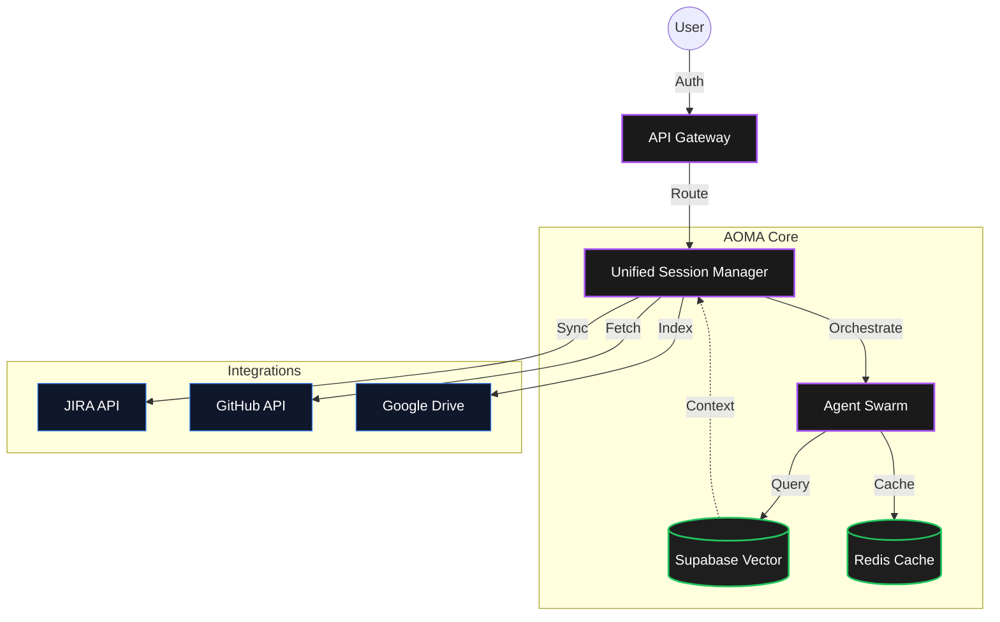

# AOMA System Architecture

**System:** AOMA (Asset & Offering Management Application)
**Type:** Multi-Tenant Distributed System

## Architecture Overview
AOMA uses a hub-and-spoke model where the Unified Session Manager (USM) acts as the central orchestrator. It integrates with external providers for authentication, storage, and workflow management.

### Key Components
1.  **API Gateway:** Entry point for all client requests, handling routing and authentication.
2.  **Unified Session Manager (USM):** The core "brain" of AOMA, managing user sessions and orchestration.
3.  **Agent Swarm:** specialized microservices/agents that perform specific tasks (e.g., metadata validation, rights checking).
4.  **Supabase Vector:** Stores embeddings for semantic search and RAG capabilities.
5.  **Redis Cache:** High-speed caching for session data and frequently accessed metadata.

## Integration Points
*   **JIRA API:** For ticket synchronization and status updates.
*   **GitHub API:** For code retrieval and commit history.
*   **Google Drive:** For indexing unstructured documents.

## Diagram

