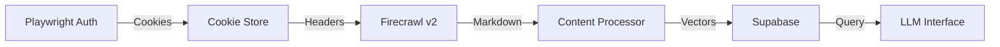

# AOMA Stage Firecrawl Integration - Technical Implementation Guide

**Version:** 1.0  
**Date:** January 2025  
**Author:** Technical Architecture Team  
**Status:** Implementation Required

---

## Executive Summary

We have successfully implemented Azure AD authentication with 2FA for AOMA Stage but have not progressed beyond login. This document provides a complete implementation guide for crawling AOMA Stage content using Firecrawl v2 with our existing authentication infrastructure.

**Current State:** ✅ Login working | ❌ No content extraction  
**Target State:** Automated content crawling → Vector store → LLM-ready knowledge base

---

## Problem Statement

### What's Working

- Playwright-based Azure AD authentication with auto-filled credentials
- 2FA phone approval flow
- Cookie extraction and persistence (`tmp/aoma-stage-storage.json`)
- Session validation logic

### What's Not Working

- No actual content extraction after authentication
- No integration between auth cookies and Firecrawl
- No data pipeline to Supabase vector store
- No LLM-friendly content transformation

---

## Architecture Overview



---

## Implementation Plan

### Phase 1: Firecrawl Service Integration

Create a new service that bridges our authentication with Firecrawl's crawling capabilities.

**File:** `src/services/aomaFirecrawlService.ts`

````typescript
import FirecrawlApp from "@mendable/firecrawl-js";
import { aomaStageAuthenticator } from "./aomaStageAuthenticator";
import { supabase } from "@/lib/supabase";
import { openai } from "@ai-sdk/openai";
import { embed } from "ai";

interface CrawlConfig {
  maxPages?: number;
  includePaths?: string[];
  excludePaths?: string[];
  depth?: number;
}

interface ProcessedContent {
  url: string;
  title: string;
  content: string;
  markdown: string;
  embedding: number[];
  metadata: Record<string, any>;
}

export class AomaFirecrawlService {
  private firecrawl: FirecrawlApp;
  private baseUrl: string;

  constructor() {
    this.firecrawl = new FirecrawlApp({
      apiKey: process.env.FIRECRAWL_API_KEY!,
    });
    this.baseUrl = process.env.AOMA_STAGE_URL || "https://aoma-stage.smcdp-de.net";
  }

  /**
   * Main crawl orchestration method
   * Handles auth, crawling, processing, and storage
   */
  async crawlAomaContent(config: CrawlConfig = {}): Promise<{
    success: boolean;
    pagesProcessed: number;
    errors: string[];
  }> {
    const errors: string[] = [];
    let pagesProcessed = 0;

    try {
      // Step 1: Ensure we have valid authentication
      console.log("🔐 Ensuring authentication...");
      const cookieHeader = await aomaStageAuthenticator.ensureAuthenticated();

      // Step 2: Configure crawl parameters
      const crawlConfig = this.buildCrawlConfig(config, cookieHeader);

      // Step 3: Execute crawl
      console.log("🕷️ Starting Firecrawl crawl...");
      const crawlResult = await this.executeCrawl(crawlConfig);

      // Step 4: Process and store results
      console.log(`📝 Processing ${crawlResult.data.length} pages...`);
      for (const page of crawlResult.data) {
        try {
          await this.processAndStorePage(page);
          pagesProcessed++;
        } catch (error) {
          errors.push(`Failed to process ${page.url}: ${error.message}`);
        }
      }

      // Step 5: Update sync status
      await this.updateSyncStatus(pagesProcessed, errors);

      return {
        success: errors.length === 0,
        pagesProcessed,
        errors,
      };
    } catch (error) {
      console.error("❌ Crawl failed:", error);
      errors.push(`Critical failure: ${error.message}`);
      return {
        success: false,
        pagesProcessed,
        errors,
      };
    }
  }

  /**
   * Build Firecrawl configuration with auth headers
   */
  private buildCrawlConfig(config: CrawlConfig, cookieHeader: string) {
    return {
      url: this.baseUrl,
      crawlerOptions: {
        includes: config.includePaths || [
          "/apps/*",
          "/api/v1/docs/*",
          "/knowledge/*",
          "/help/*",
          "/documentation/*",
        ],
        excludes: config.excludePaths || ["/admin/*", "/logout", "/download/*", "*.pdf", "*.zip"],
        maxCrawlPages: config.maxPages || 100,
        maxCrawlDepth: config.depth || 3,
        allowBackwardCrawling: false,
        generateImgAltText: false,
      },
      pageOptions: {
        headers: {
          Cookie: cookieHeader,
          "User-Agent": "Mozilla/5.0 (compatible; SIAM-Crawler/1.0)",
          Accept: "text/html,application/xhtml+xml",
          "Accept-Language": "en-US,en;q=0.9",
        },
        onlyMainContent: true,
        includeHtml: false,
        screenshot: false,
        waitFor: 2000,
        formats: ["markdown"] as const,
        removeBase64Images: true,
      },
    };
  }

  /**
   * Execute the Firecrawl crawl
   */
  private async executeCrawl(config: any) {
    // Use crawlUrl for site crawling
    const result = await this.firecrawl.crawlUrl(
      config.url,
      {
        ...config.crawlerOptions,
        ...config.pageOptions,
      },
      true // wait for completion
    );

    if (!result.success) {
      throw new Error(`Crawl failed: ${result.error}`);
    }

    return result;
  }

  /**
   * Process a single page and store in Supabase
   */
  private async processAndStorePage(page: any): Promise<void> {
    // Extract content
    const processedContent = await this.processPageContent(page);

    // Generate embedding
    const embedding = await this.generateEmbedding(processedContent.content);

    // Store in Supabase
    await this.storeInVectorDatabase({
      ...processedContent,
      embedding,
    });
  }

  /**
   * Process raw page content into structured format
   */
  private async processPageContent(page: any): Promise<Omit<ProcessedContent, "embedding">> {
    const { markdown, metadata, url } = page;

    // Clean and structure the content
    const cleanedMarkdown = this.cleanMarkdown(markdown);
    const title = metadata?.title || this.extractTitleFromMarkdown(cleanedMarkdown);

    // Extract key information
    const processedMetadata = {
      originalUrl: url,
      title,
      description: metadata?.description || "",
      crawledAt: new Date().toISOString(),
      contentLength: cleanedMarkdown.length,
      section: this.categorizeContent(url),
      keywords: this.extractKeywords(cleanedMarkdown),
    };

    return {
      url,
      title,
      content: cleanedMarkdown,
      markdown: cleanedMarkdown,
      metadata: processedMetadata,
    };
  }

  /**
   * Generate embedding using OpenAI
   */
  private async generateEmbedding(content: string): Promise<number[]> {
    // Truncate content to fit token limits
    const truncatedContent = content.slice(0, 8000);

    const { embedding } = await embed({
      model: openai.embedding("text-embedding-3-small"),
      value: truncatedContent,
    });

    return embedding;
  }

  /**
   * Store processed content in Supabase vector store
   */
  private async storeInVectorDatabase(content: ProcessedContent): Promise<void> {
    const { error } = await supabase.from("aoma_unified_vectors").upsert(
      {
        content: content.content,
        embedding: content.embedding,
        source_type: "aoma_docs",
        source_id: content.url,
        metadata: content.metadata,
        updated_at: new Date().toISOString(),
      },
      {
        onConflict: "source_id",
      }
    );

    if (error) {
      throw new Error(`Failed to store in database: ${error.message}`);
    }
  }

  /**
   * Clean markdown content for better LLM processing
   */
  private cleanMarkdown(markdown: string): string {
    return (
      markdown
        // Remove excessive newlines
        .replace(/\n{3,}/g, "\n\n")
        // Remove image tags without alt text
        .replace(/!\[\]\([^)]+\)/g, "")
        // Clean up code blocks
        .replace(/```\s*\n```/g, "")
        // Remove HTML comments
        .replace(/<!--[\s\S]*?-->/g, "")
        // Trim whitespace
        .trim()
    );
  }

  /**
   * Extract title from markdown if not in metadata
   */
  private extractTitleFromMarkdown(markdown: string): string {
    const match = markdown.match(/^#\s+(.+)$/m);
    return match ? match[1] : "Untitled Page";
  }

  /**
   * Categorize content based on URL patterns
   */
  private categorizeContent(url: string): string {
    if (url.includes("/api/")) return "api_documentation";
    if (url.includes("/knowledge/")) return "knowledge_base";
    if (url.includes("/help/")) return "help_documentation";
    if (url.includes("/apps/")) return "application_documentation";
    return "general_documentation";
  }

  /**
   * Extract keywords for better searchability
   */
  private extractKeywords(content: string): string[] {
    // Simple keyword extraction - can be enhanced with NLP
    const words = content
      .toLowerCase()
      .replace(/[^a-z0-9\s]/g, " ")
      .split(/\s+/)
      .filter((word) => word.length > 4);

    // Get unique words with frequency
    const wordFreq = new Map<string, number>();
    words.forEach((word) => {
      wordFreq.set(word, (wordFreq.get(word) || 0) + 1);
    });

    // Return top 10 most frequent words
    return Array.from(wordFreq.entries())
      .sort((a, b) => b[1] - a[1])
      .slice(0, 10)
      .map(([word]) => word);
  }

  /**
   * Update sync status in database
   */
  private async updateSyncStatus(recordsCount: number, errors: string[]): Promise<void> {
    await supabase.from("aoma_source_sync").upsert({
      source_type: "aoma_docs",
      last_sync: new Date().toISOString(),
      sync_status: errors.length === 0 ? "success" : "partial",
      records_count: recordsCount,
      error_message: errors.length > 0 ? errors.join("; ") : null,
    });
  }
}

export const aomaFirecrawl = new AomaFirecrawlService();
````

### Phase 2: API Endpoint for Manual Triggering

Create an API endpoint to trigger crawls manually or via cron.

**File:** `app/api/crawl/aoma/route.ts`

```typescript
import { NextRequest, NextResponse } from "next/server";
import { aomaFirecrawl } from "@/services/aomaFirecrawlService";

export async function POST(request: NextRequest) {
  try {
    // Optional: Add authentication check here
    const authHeader = request.headers.get("authorization");
    if (authHeader !== `Bearer ${process.env.CRAWL_API_KEY}`) {
      return NextResponse.json({ error: "Unauthorized" }, { status: 401 });
    }

    // Get crawl configuration from request body
    const config = await request.json();

    // Execute crawl
    const result = await aomaFirecrawl.crawlAomaContent(config);

    return NextResponse.json(result);
  } catch (error) {
    console.error("Crawl API error:", error);
    return NextResponse.json({ error: "Crawl failed", message: error.message }, { status: 500 });
  }
}
```

### Phase 3: Incremental Crawling Strategy

Implement smart crawling to only fetch updated content.

**File:** `src/services/aomaIncrementalCrawler.ts`

```typescript
import { aomaFirecrawl } from "./aomaFirecrawlService";
import { supabase } from "@/lib/supabase";

export class AomaIncrementalCrawler {
  /**
   * Perform incremental crawl based on last sync time
   */
  async performIncrementalCrawl(): Promise<void> {
    // Get last successful sync time
    const lastSync = await this.getLastSyncTime();

    // Determine pages to crawl
    const pagesToCrawl = await this.identifyUpdatedPages(lastSync);

    // Crawl only updated pages
    if (pagesToCrawl.length > 0) {
      await this.crawlSpecificPages(pagesToCrawl);
    }
  }

  private async getLastSyncTime(): Promise<Date> {
    const { data } = await supabase
      .from("aoma_source_sync")
      .select("last_sync")
      .eq("source_type", "aoma_docs")
      .single();

    return data?.last_sync ? new Date(data.last_sync) : new Date(0);
  }

  private async identifyUpdatedPages(since: Date): Promise<string[]> {
    // This would require AOMA to expose a changes API
    // For now, we'll implement a smart crawl strategy

    // Priority pages that change frequently
    const priorityPages = ["/api/v1/docs/latest", "/knowledge/recent", "/apps/updates"];

    // Add pages modified since last sync (if AOMA provides this)
    // const modifiedPages = await this.fetchModifiedPages(since);

    return priorityPages;
  }

  private async crawlSpecificPages(urls: string[]): Promise<void> {
    for (const url of urls) {
      await aomaFirecrawl.crawlSinglePage(url);
    }
  }
}
```

---

## Database Schema

### Required Supabase Tables

```sql
-- 1. Main vector store (if not already created)
CREATE TABLE IF NOT EXISTS aoma_unified_vectors (
  id BIGSERIAL PRIMARY KEY,
  content TEXT NOT NULL,
  embedding vector(1536), -- OpenAI embedding dimensions
  source_type TEXT NOT NULL CHECK (source_type IN ('aoma_docs', 'jira', 'git', 'email', 'confluence')),
  source_id TEXT NOT NULL UNIQUE,
  metadata JSONB NOT NULL DEFAULT '{}',
  created_at TIMESTAMPTZ DEFAULT NOW(),
  updated_at TIMESTAMPTZ DEFAULT NOW()
);

-- 2. Create vector similarity search index
CREATE INDEX IF NOT EXISTS aoma_vectors_embedding_idx
ON aoma_unified_vectors
USING ivfflat (embedding vector_cosine_ops)
WITH (lists = 100);

-- 3. Source synchronization tracking
CREATE TABLE IF NOT EXISTS aoma_source_sync (
  source_type TEXT PRIMARY KEY,
  last_sync TIMESTAMPTZ,
  sync_status TEXT CHECK (sync_status IN ('success', 'partial', 'error', 'in_progress')),
  records_count INTEGER DEFAULT 0,
  error_message TEXT,
  metadata JSONB DEFAULT '{}'
);

-- 4. Crawl history for debugging
CREATE TABLE IF NOT EXISTS aoma_crawl_history (
  id BIGSERIAL PRIMARY KEY,
  started_at TIMESTAMPTZ DEFAULT NOW(),
  completed_at TIMESTAMPTZ,
  pages_crawled INTEGER DEFAULT 0,
  pages_failed INTEGER DEFAULT 0,
  errors JSONB DEFAULT '[]',
  config JSONB DEFAULT '{}',
  status TEXT CHECK (status IN ('running', 'completed', 'failed'))
);

-- 5. Function for semantic search
CREATE OR REPLACE FUNCTION search_aoma_content(
  query_embedding vector(1536),
  match_threshold float DEFAULT 0.78,
  match_count int DEFAULT 10
)
RETURNS TABLE (
  id bigint,
  content text,
  source_type text,
  metadata jsonb,
  similarity float
)
LANGUAGE SQL STABLE
AS $$
  SELECT
    id,
    content,
    source_type,
    metadata,
    1 - (embedding <=> query_embedding) AS similarity
  FROM aoma_unified_vectors
  WHERE 1 - (embedding <=> query_embedding) > match_threshold
  ORDER BY embedding <=> query_embedding
  LIMIT match_count;
$$;
```

---

## Environment Variables

Add these to your `.env.local`:

```bash
# Firecrawl Configuration
FIRECRAWL_API_KEY=fc-xxxxxxxxxxxxxxxxxxxxxxxxxxxxxxxx

# AOMA Authentication
AAD_USERNAME=your.name@sonymusic.com
AAD_PASSWORD=your-password
AOMA_STAGE_URL=https://aoma-stage.smcdp-de.net
AOMA_LOGIN_MAX_WAIT_MS=180000

# Crawl Configuration
CRAWL_API_KEY=your-secret-api-key-for-triggering-crawls
CRAWL_MAX_PAGES=100
CRAWL_DEPTH=3

# OpenAI for Embeddings
OPENAI_API_KEY=sk-xxxxxxxxxxxxxxxxxxxxxxxxxxxxxxxx
```

---

## Testing Strategy

### 1. Test Authentication Flow

```typescript
// test/aoma-auth.test.ts
describe("AOMA Authentication", () => {
  it("should successfully authenticate and retrieve cookies", async () => {
    const cookieHeader = await aomaStageAuthenticator.ensureAuthenticated();
    expect(cookieHeader).toContain("session");
    expect(cookieHeader).toContain("auth");
  });
});
```

### 2. Test Single Page Crawl

```typescript
// test/aoma-crawl.test.ts
describe("AOMA Firecrawl", () => {
  it("should crawl a single page with auth", async () => {
    const result = await aomaFirecrawl.crawlSinglePage("/api/v1/docs");
    expect(result.success).toBe(true);
    expect(result.content).toContain("API Documentation");
  });
});
```

### 3. Test Vector Storage

```typescript
// test/vector-storage.test.ts
describe("Vector Storage", () => {
  it("should store and retrieve content with embeddings", async () => {
    const testContent = {
      content: "Test AOMA documentation content",
      source_type: "aoma_docs",
      source_id: "/test/page",
    };

    // Store
    await aomaFirecrawl.storeInVectorDatabase(testContent);

    // Search
    const results = await searchAomaContent("test documentation");
    expect(results[0].source_id).toBe("/test/page");
  });
});
```

---

## Monitoring & Observability

### 1. Crawl Status Dashboard

Create a simple dashboard to monitor crawl status:

```typescript
// app/api/crawl/status/route.ts
export async function GET() {
  const { data: syncStatus } = await supabase
    .from("aoma_source_sync")
    .select("*")
    .eq("source_type", "aoma_docs")
    .single();

  const { data: recentCrawls } = await supabase
    .from("aoma_crawl_history")
    .select("*")
    .order("started_at", { ascending: false })
    .limit(10);

  return NextResponse.json({
    lastSync: syncStatus?.last_sync,
    status: syncStatus?.sync_status,
    recordsCount: syncStatus?.records_count,
    recentCrawls,
  });
}
```

### 2. Error Tracking

```typescript
// src/utils/errorTracking.ts
export async function logCrawlError(error: Error, context: any) {
  console.error("[CRAWL ERROR]", error, context);

  // Log to database
  await supabase.from("aoma_crawl_errors").insert({
    error_message: error.message,
    error_stack: error.stack,
    context,
    occurred_at: new Date().toISOString(),
  });

  // Optional: Send to Sentry or other monitoring service
  // Sentry.captureException(error, { extra: context });
}
```

---

## Troubleshooting Guide

### Common Issues and Solutions

#### 1. Authentication Fails

```bash
# Check if cookies are being saved
cat tmp/aoma-stage-storage.json | jq '.cookies'

# Verify environment variables
echo $AAD_USERNAME
echo $AOMA_STAGE_URL

# Test authentication manually
node scripts/aoma-stage-login.js
```

#### 2. Firecrawl Returns 401/403

```javascript
// Debug cookie header
const cookieHeader = await aomaStageAuthenticator.getCookieHeader();
console.log('Cookie header:', cookieHeader);

// Test with curl
curl -H "Cookie: ${cookieHeader}" https://aoma-stage.smcdp-de.net/api/health
```

#### 3. Embeddings Fail

```javascript
// Check OpenAI API key
const test = await openai.embeddings.create({
  model: "text-embedding-3-small",
  input: "test",
});
```

#### 4. Vector Search Returns No Results

```sql
-- Check if vectors are stored
SELECT COUNT(*) FROM aoma_unified_vectors WHERE source_type = 'aoma_docs';

-- Test similarity search manually
SELECT id, content, 1 - (embedding <=> (
  SELECT embedding FROM aoma_unified_vectors LIMIT 1
)) as similarity
FROM aoma_unified_vectors
ORDER BY similarity DESC
LIMIT 5;
```

---

## Performance Optimization

### 1. Batch Processing

```typescript
// Process pages in batches to avoid memory issues
async function batchProcess(pages: any[], batchSize = 10) {
  for (let i = 0; i < pages.length; i += batchSize) {
    const batch = pages.slice(i, i + batchSize);
    await Promise.all(batch.map((page) => processPage(page)));
  }
}
```

### 2. Caching Strategy

```typescript
// Cache frequently accessed content
const cache = new Map<string, any>();

async function getCachedOrFetch(url: string) {
  if (cache.has(url)) {
    return cache.get(url);
  }
  const result = await fetchContent(url);
  cache.set(url, result);
  return result;
}
```

### 3. Rate Limiting

```typescript
// Respect AOMA's rate limits
import pLimit from "p-limit";

const limit = pLimit(5); // Max 5 concurrent requests

async function crawlWithRateLimit(urls: string[]) {
  return Promise.all(urls.map((url) => limit(() => crawlPage(url))));
}
```

---

## Next Steps

### Immediate Actions (This Week)

1. ✅ Implement `aomaFirecrawlService.ts`
2. ✅ Set up Supabase tables
3. ✅ Test single page crawl with authentication
4. ✅ Verify embeddings generation

### Short Term (Next 2 Weeks)

1. ⬜ Implement incremental crawling
2. ⬜ Build monitoring dashboard
3. ⬜ Add error recovery mechanisms
4. ⬜ Optimize for large-scale crawling

### Long Term (Month 2)

1. ⬜ Implement intelligent content updates
2. ⬜ Add multi-source correlation (JIRA, Confluence)
3. ⬜ Build LLM query interface
4. ⬜ Performance optimization for 10,000+ pages

---

## Success Metrics

| Metric              | Target           | Measurement                               |
| ------------------- | ---------------- | ----------------------------------------- |
| Crawl Success Rate  | >95%             | Successful pages / Total attempted        |
| Content Freshness   | <24 hours        | Time since last successful sync           |
| Query Response Time | <1 second        | Vector search + LLM response              |
| Storage Efficiency  | <10GB            | Total database size for 10k pages         |
| Embedding Quality   | >0.85 similarity | Average similarity score for test queries |

---

## Conclusion

This implementation bridges the gap between successful authentication and actual content extraction. By combining Playwright's auth capabilities with Firecrawl's efficient crawling and Supabase's vector storage, we create a robust knowledge extraction pipeline.

**Key Takeaways:**

1. Keep Playwright for auth, use Firecrawl for crawling
2. Store everything in vectors for fast semantic search
3. Monitor and optimize continuously
4. Plan for incremental updates from day one

**Questions?** Reach out to the architecture team or consult the troubleshooting guide above.
