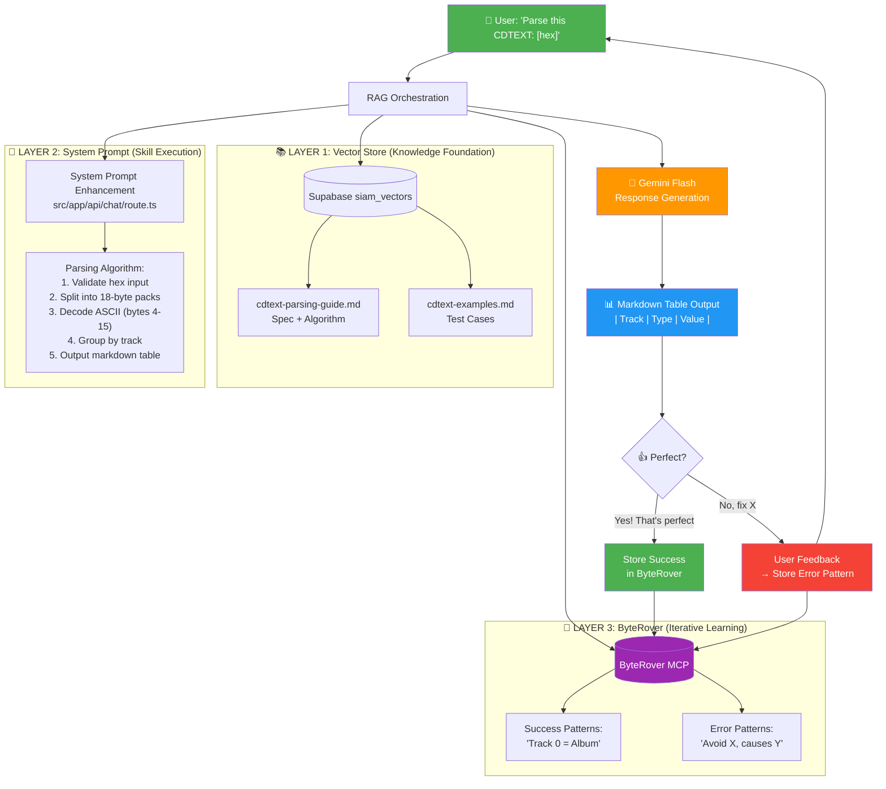
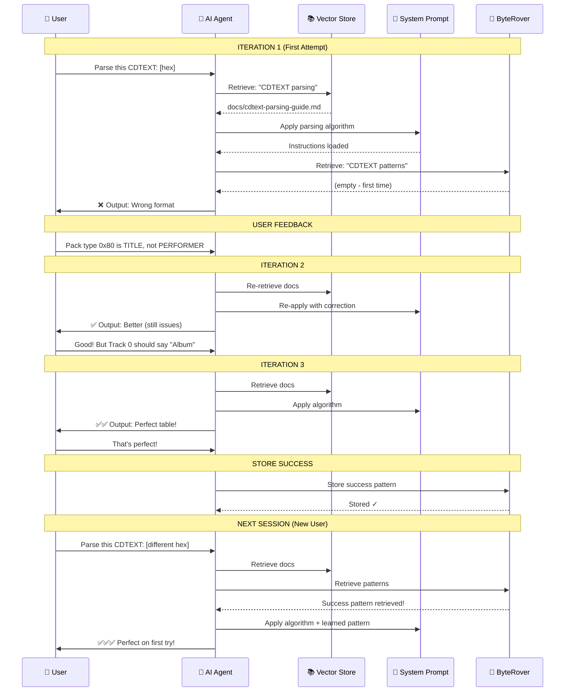
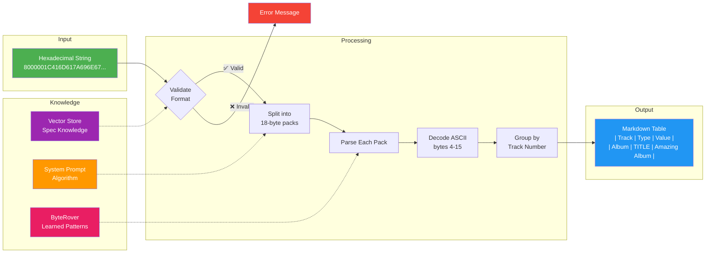
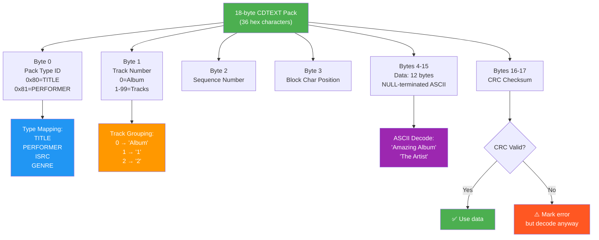
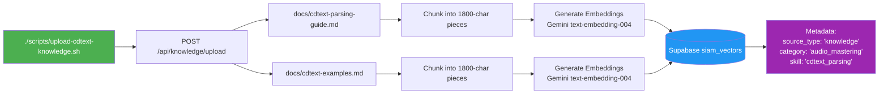
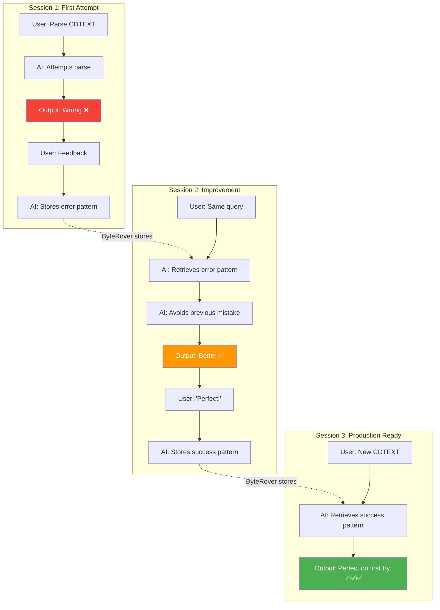
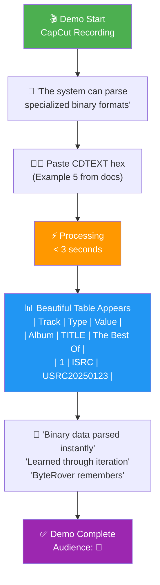
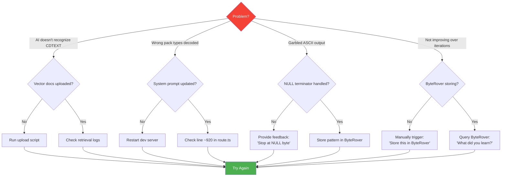

# CDTEXT Skill - Architecture Diagram

This document visualizes how the three-layer architecture works together.

---

## 🏗️ Three-Layer Architecture

---

## 🔄 Iteration Cycle Detail

---

## 📦 Data Flow Diagram

---

## 🎯 Pack Structure Breakdown

---

## 🚀 Upload Workflow

---

## 🧠 ByteRover Learning Cycle

---

## 📊 Demo Flow

---

## 🔧 Troubleshooting Decision Tree

---

**These diagrams visualize:**
- ✅ Three-layer architecture (Vector + Prompt + ByteRover)
- ✅ Iteration cycle (feedback → learning → improvement)
- ✅ Data flow (hex → parse → table)
- ✅ Pack structure breakdown
- ✅ Upload workflow
- ✅ Demo flow
- ✅ Troubleshooting paths

**Use for:**
- Technical documentation
- Demo slides (via Nano Banana)
- Stakeholder presentations
- Developer onboarding

*Created: December 19, 2025*  
*For: Mattie (by Claudette)*

