# SIAM & AOMA Mesh MCP - Mermaid System Diagrams

Export these to Excalidraw for refinement.

---

## 1. SIAM High-Level Architecture

```mermaid
graph TB
    subgraph "User Layer"
        Browser[🌐 User Browser]
        ChatUI[💬 Chat Interface<br/>Vercel AI SDK v5]
        Voice[🎤 Voice I/O<br/>ElevenLabs]
    end

    subgraph "Application Server - Render.com"
        NextJS[⚡ Next.js 15.5.6<br/>thebetabase.com]
        ChatAPI[📡 /api/chat/route.ts]
        Auth[🔐 Auth Middleware<br/>Magic Link]
        Cache[💾 Query Cache<br/>In-Memory]
        Orchestrator[🎯 AOMA Orchestrator<br/>15s timeout]
    end

    subgraph "AI Services"
        OpenAI[🤖 OpenAI GPT-4o<br/>+ o1-reasoning]
        Embeddings[📊 text-embedding-3-small<br/>1536 dimensions]
        ElevenLabs[🔊 ElevenLabs API<br/>Voice Synthesis]
    end

    subgraph "Data Layer"
        Supabase[(🗄️ Supabase Postgres<br/>kfxetwuuzljhybfgmpuc)]
        VectorTable[(📦 aoma_unified_vectors<br/>28 rows, pgvector)]
        VectorFunc[⚙️ match_aoma_vectors()<br/>threshold: 0.50]
        Railway[🚂 Railway MCP Server<br/>aoma-mesh-mcp]
    end

    Browser --> ChatUI
    ChatUI --> Voice
    ChatUI -->|POST /api/chat| NextJS
    NextJS --> Auth
    Auth --> ChatAPI
    ChatAPI --> Cache
    Cache -->|Cache Miss| Orchestrator

    Orchestrator -->|Parallel Query| VectorSearch[🔍 Vector Search Service]
    Orchestrator -->|Parallel Query| Railway

    VectorSearch -->|Generate Embedding| Embeddings
    VectorSearch -->|Query| Supabase
    Supabase --> VectorTable
    VectorTable --> VectorFunc

    Orchestrator -->|AI Response| OpenAI
    ChatAPI -->|Stream Response| ChatUI
    ChatUI -->|Voice Output| ElevenLabs

    style Browser fill:#e1f5ff
    style NextJS fill:#fff3e0
    style Supabase fill:#c8e6c9
    style Railway fill:#ffccbc
    style Orchestrator fill:#fff9c4
    style OpenAI fill:#f3e5f5
```

---

## 2. SIAM Chat Query Flow (Fast Path - Vector Success)

```mermaid
sequenceDiagram
    participant U as 👤 User
    participant UI as 💬 Chat UI
    participant API as 📡 Chat API
    participant Cache as 💾 Cache
    participant Orch as 🎯 Orchestrator
    participant Vec as 🔍 Vector Search
    participant Emb as 📊 Embeddings
    participant SB as 🗄️ Supabase
    participant Rail as 🚂 Railway MCP
    participant AI as 🤖 GPT-4o

    U->>UI: "What is AOMA?"
    UI->>API: POST /api/chat
    API->>Cache: Check cache key
    Cache-->>API: MISS

    API->>Orch: Execute query

    par Parallel Execution
        Orch->>Vec: Query vectors
        Orch->>Rail: Query Railway MCP
    end

    Vec->>Emb: Generate embedding
    Note over Emb: ~200ms
    Emb-->>Vec: [0.123, -0.456, ...] (1536)

    Vec->>SB: match_aoma_vectors(embedding, 0.50)
    Note over SB: ~1.5-2.5s
    SB-->>Vec: 5 results (59.5% similarity)

    Rail-->>Orch: Response (2-3ms cached)

    Vec-->>Orch: Vector results ✅
    Note over Orch: Vector wins!

    Orch->>AI: Generate response with context
    Note over AI: ~10-12s streaming
    AI-->>Orch: Streamed tokens

    Orch-->>API: Response stream
    API->>Cache: Store result
    API-->>UI: Stream to client
    UI-->>U: Display response

    Note over U,AI: TOTAL TIME: ~14 seconds (first query)
    Note over U,AI: TOTAL TIME: <500ms (cached query)
```



---

## 3. SIAM Chat Query Flow (Slow Path - Vector Fails)

```mermaid
sequenceDiagram
    participant U as 👤 User
    participant API as 📡 Chat API
    participant Orch as 🎯 Orchestrator
    participant Vec as 🔍 Vector Search
    participant SB as 🗄️ Supabase
    participant Rail as 🚂 Railway MCP
    participant AI as 🤖 GPT-4o

    U->>API: Complex query
    API->>Orch: Execute query

    par Parallel Execution
        Orch->>Vec: Query vectors
        Orch->>Rail: Query Railway MCP
    end

    Vec->>SB: match_aoma_vectors()
    Note over SB: ~1.5s
    SB-->>Vec: 0 results ❌

    Vec-->>Orch: No vector results

    Note over Rail: Complex query<br/>requires API calls
    Note over Rail: ~15-25 seconds ⚠️

    Rail-->>Orch: Railway response

    rect rgb(255, 200, 200)
        Note over Orch: Orchestrator timeout<br/>at 15 seconds
        Note over Orch: Falls back to<br/>Railway MCP result
    end

    Orch->>AI: Generate with Railway context
    Note over AI: ~10s
    AI-->>Orch: Response

    Orch-->>API: Response stream
    API-->>U: Display response

    Note over U,AI: TOTAL TIME: ~30 seconds
```



---

## 4. AOMA Orchestrator Decision Logic

```mermaid
flowchart TD
    Start([User Query]) --> Normalize[Normalize Query<br/>lowercase, dedupe spaces]
    Normalize --> CheckCache{Cache Hit?}

    CheckCache -->|Yes| ReturnCache[Return Cached Response<br/>< 500ms]
    CheckCache -->|No| Parallel[Start Parallel Queries]

    Parallel --> VectorPath[Vector Search Path]
    Parallel --> RailwayPath[Railway MCP Path]

    VectorPath --> GenEmbed[Generate Embedding<br/>~200ms]
    GenEmbed --> QueryVec[Query Supabase<br/>match_aoma_vectors]
    QueryVec --> VecResults{Results > 0?}

    VecResults -->|Yes| VecSuccess[5 results<br/>1.5-2.5s ✅]
    VecResults -->|No| VecFail[0 results<br/>1.5s ❌]

    RailwayPath --> RailFast{Cached?}
    RailFast -->|Yes| RailQuick[Railway Response<br/>2-3ms 🚀]
    RailFast -->|No| RailSlow[Railway API Call<br/>15-25s 🐌]

    VecSuccess --> Winner{First to<br/>Complete?}
    VecFail --> Winner
    RailQuick --> Winner
    RailSlow --> Winner

    Winner -->|Vector Success| UseVector[Use Vector Context]
    Winner -->|Vector Empty| UseRailway[Use Railway Context]
    Winner -->|Timeout 15s| Timeout[⏱️ Timeout Fallback]

    UseVector --> GenAI[Generate AI Response<br/>GPT-4o + o1]
    UseRailway --> GenAI
    Timeout --> GenAI

    GenAI --> Stream[Stream Tokens<br/>~10-12s]
    Stream --> StoreCache[Store in Cache]
    StoreCache --> Return([Return to User])

    ReturnCache --> Return

    style VecSuccess fill:#c8e6c9
    style RailQuick fill:#c8e6c9
    style VecFail fill:#ffcdd2
    style RailSlow fill:#ffcdd2
    style Timeout fill:#fff9c4
    style Winner fill:#fff9c4
```



---

## 5. Vector Search Optimization Timeline

```mermaid
timeline
    title SIAM Vector Search Performance Fix - 2025-10-28

    section Before Fix
        Problem Identified : Vector search returns 0 results
                          : Threshold too high (0.78 = 78%)
                          : Best similarity only 59.5%
                          : Always falls back to Railway MCP
                          : Response time 30+ seconds

    section Investigation
        Root Cause Found : Current content is login pages
                        : Limited semantic information
                        : Threshold mismatch (59.5% < 78%)
                        : Diagnostic script confirms scores

    section Solution
        Code Changes : Lower threshold 0.78 → 0.50
                    : Update 4 files
                    : supabaseVectorService.ts
                    : optimizedSupabaseVectorService.ts
                    : knowledgeSearchService.ts
                    : app/api/chat/route.ts

    section Blocker
        Schema Cache Issue : PostgREST schema cache not refreshed
                          : Function exists but not accessible
                          : PGRST202 error in logs
                          : Wait 40 minutes for auto-refresh

    section After Fix
        Success : Vector search returns 5 results ✅
               : Similarity 59.5% > 50% threshold
               : Response time ~14 seconds (first)
               : Cache hits < 500ms
               : 53% faster than before
```



---

## 6. AOMA Mesh MCP Server Architecture

```mermaid
graph TB
    subgraph "MCP Clients"
        Claude[🤖 Claude Desktop]
        VSCode[💻 VS Code]
        SIAM[🌐 SIAM/Betabase]
    end

    subgraph "Railway Deployment"
        Health[🏥 /health endpoint]
        MCPServer[⚙️ AOMA Mesh MCP Server<br/>v2.7.0]
        HTTPBridge[🌉 HTTP Bridge<br/>REST → MCP]
    end

    subgraph "MCP Tools"
        AomaKnowledge[📚 aoma-knowledge.tool.ts<br/>OpenAI Assistant API]
        JiraSearch[🎫 jira-search.tool.ts<br/>Vector + Text Search]
        GitSearch[🔍 git-search.tool.ts<br/>Semantic Search]
        CodeSearch[💻 code-search.tool.ts<br/>Vector Search]
        DevContext[🛠️ development-context.tool.ts<br/>Analysis]
        SwarmAnalysis[🐝 swarm-analysis.tool.ts<br/>Cross-Vector Intelligence]
    end

    subgraph "Services"
        Langchain[🔗 LangChain Orchestrator]
        OpenAIService[🤖 OpenAI Service]
        SupabaseService[🗄️ Supabase Service]
    end

    subgraph "Data Sources"
        Supabase[(🗄️ Supabase Postgres)]
        JiraTickets[(🎫 jira_tickets<br/>6,554+ tickets)]
        JiraEmbed[(📊 jira_ticket_embeddings<br/>Vector Embeddings)]
        GitCommits[(📝 git_commits)]
        CodeFiles[(📄 code_files)]
        GitFileEmbed[(📊 git_file_embeddings)]
        OpenAIAssist[🤖 OpenAI Assistant<br/>AOMA Knowledge Base]
    end

    Claude -->|stdio| MCPServer
    VSCode -->|stdio| MCPServer
    SIAM -->|HTTP REST| HTTPBridge
    HTTPBridge --> MCPServer

    MCPServer --> Health

    MCPServer --> AomaKnowledge
    MCPServer --> JiraSearch
    MCPServer --> GitSearch
    MCPServer --> CodeSearch
    MCPServer --> DevContext
    MCPServer --> SwarmAnalysis

    AomaKnowledge --> OpenAIService
    JiraSearch --> Langchain
    GitSearch --> SupabaseService
    CodeSearch --> SupabaseService
    DevContext --> Langchain
    SwarmAnalysis --> Langchain

    Langchain --> SupabaseService
    OpenAIService --> OpenAIAssist
    SupabaseService --> Supabase

    Supabase --> JiraTickets
    Supabase --> JiraEmbed
    Supabase --> GitCommits
    Supabase --> CodeFiles
    Supabase --> GitFileEmbed

    style MCPServer fill:#ffccbc
    style Supabase fill:#c8e6c9
    style Langchain fill:#fff9c4
    style OpenAIAssist fill:#f3e5f5
```



---

## 7. AOMA Mesh MCP Tool Interactions


---

## 8. Data Flow: ETL to Serving

```mermaid
flowchart LR
    subgraph "Data Collection - SIAM/Betabase"
        PW[🎭 Playwright<br/>AOMA Scraping]
        JQL[🔍 JQL Queries<br/>JIRA API]
        Conf[📄 Confluence<br/>Web Scraping]
        Git[🌳 Git Repos<br/>Code Analysis]
    end

    subgraph "ETL Processing"
        Dedupe[🔄 De-duplication]
        Embed[📊 Generate Embeddings<br/>OpenAI]
        Transform[⚙️ Transform & Clean]
    end

    subgraph "Storage - Supabase"
        AOMA[(📚 aoma_unified_vectors)]
        JIRA[(🎫 jira_tickets<br/>jira_ticket_embeddings)]
        GIT[(📝 git_commits<br/>git_file_embeddings)]
        CODE[(💻 code_files)]
    end

    subgraph "Serving - Railway MCP"
        MCP[⚙️ AOMA Mesh MCP<br/>Read-Only Access]
    end

    subgraph "Consumers"
        Claude[🤖 Claude Desktop]
        VSCode[💻 VS Code]
        Web[🌐 SIAM Web App]
    end

    PW --> Dedupe
    JQL --> Dedupe
    Conf --> Dedupe
    Git --> Dedupe

    Dedupe --> Embed
    Embed --> Transform

    Transform --> AOMA
    Transform --> JIRA
    Transform --> GIT
    Transform --> CODE

    AOMA --> MCP
    JIRA --> MCP
    GIT --> MCP
    CODE --> MCP

    MCP --> Claude
    MCP --> VSCode
    MCP --> Web

    style AOMA fill:#c8e6c9
    style JIRA fill:#c8e6c9
    style GIT fill:#c8e6c9
    style CODE fill:#c8e6c9
    style MCP fill:#ffccbc
    style Embed fill:#fff9c4
```



---

## 9. Performance Comparison

```mermaid
graph LR
    subgraph "Before Fix - Threshold 0.78"
        Q1[Query] --> E1[Embedding<br/>200ms]
        E1 --> V1[Vector Search<br/>1.5s]
        V1 --> R1{0 results ❌}
        R1 --> F1[Fallback to Railway<br/>15-25s]
        F1 --> A1[AI Response<br/>10s]
        A1 --> T1[TOTAL: 30+ seconds 🐌]
    end

    subgraph "After Fix - Threshold 0.50"
        Q2[Query] --> E2[Embedding<br/>200ms]
        E2 --> V2[Vector Search<br/>1.5-2.5s]
        V2 --> R2{5 results ✅}
        R2 --> U2[Use Vector Context]
        U2 --> A2[AI Response<br/>10-12s]
        A2 --> T2[TOTAL: 14 seconds ⚡]
        T2 --> C2[Cached: < 500ms 🚀]
    end

    style R1 fill:#ffcdd2
    style F1 fill:#ffcdd2
    style T1 fill:#ffcdd2
    style R2 fill:#c8e6c9
    style T2 fill:#c8e6c9
    style C2 fill:#81c784
```



---

## 10. SIAM System Components

```mermaid
graph TB
    subgraph "Frontend - Next.js 15"
        Pages[📄 Pages<br/>app/]
        Components[🧩 Components<br/>src/components/]
        AIElements[✨ Vercel AI Elements<br/><Response>, <Message>]
    end

    subgraph "API Layer"
        ChatRoute[💬 /api/chat/route.ts<br/>Main Chat Endpoint]
        FileUpload[📎 /api/upload/route.ts<br/>File Processing]
        AuthAPI[🔐 /api/auth/*<br/>Magic Link]
    end

    subgraph "Services"
        Orchestrator[🎯 AOMA Orchestrator<br/>Query Routing]
        VectorService[🔍 Vector Search<br/>Supabase Client]
        KnowledgeService[📚 Knowledge Search<br/>Query Processing]
        CacheService[💾 Cache Service<br/>In-Memory Store]
    end

    subgraph "External Services"
        OpenAI[🤖 OpenAI<br/>GPT-4o + Embeddings]
        Supabase[🗄️ Supabase<br/>Postgres + pgvector]
        Railway[🚂 Railway MCP<br/>aoma-mesh-mcp]
        ElevenLabs[🔊 ElevenLabs<br/>Voice Synthesis]
        Render[☁️ Render.com<br/>Hosting]
    end

    Pages --> Components
    Components --> AIElements
    Pages --> ChatRoute

    ChatRoute --> AuthAPI
    ChatRoute --> Orchestrator
    ChatRoute --> FileUpload

    Orchestrator --> VectorService
    Orchestrator --> KnowledgeService
    Orchestrator --> CacheService
    Orchestrator --> Railway

    VectorService --> OpenAI
    VectorService --> Supabase
    KnowledgeService --> OpenAI

    AIElements --> ElevenLabs

    ChatRoute --> Render

    style Orchestrator fill:#fff9c4
    style Supabase fill:#c8e6c9
    style Railway fill:#ffccbc
    style Render fill:#e1f5ff
```



---

## 11. Authentication Flow

```mermaid
sequenceDiagram
    participant U as 👤 User
    participant UI as 🌐 Landing Page
    participant API as 📡 Auth API
    participant SB as 🗄️ Supabase Auth
    participant Email as 📧 Email Service
    participant App as 💬 Chat App

    U->>UI: Enter email
    UI->>API: POST /api/auth/magic-link
    API->>SB: Generate magic link
    SB->>Email: Send email
    Email-->>U: Magic link email

    U->>Email: Click magic link
    Email->>API: GET /api/auth/callback?token=xyz
    API->>SB: Verify token
    SB-->>API: Valid ✅

    API->>API: Create session
    API-->>App: Redirect to /chat
    App->>API: Check auth
    API-->>App: Authenticated ✅
    App-->>U: Show chat interface

    Note over U,App: Session duration: 7 days
```



---

## 12. Deployment Architecture

```mermaid
graph TB
    subgraph "GitHub"
        Repo[📦 siam Repository<br/>main branch]
        Actions[⚙️ GitHub Actions<br/>CI/CD Pipeline]
    end

    subgraph "Build Process"
        Tests[🧪 Run Tests<br/>Playwright E2E]
        TypeCheck[📝 Type Check<br/>TypeScript]
        Lint[✨ ESLint + Prettier]
        Build[🏗️ Next.js Build]
    end

    subgraph "Render.com"
        Service[🚀 Web Service<br/>thebetabase.com]
        Deploy[📦 Deploy Image]
        Health[🏥 Health Checks]
        Logs[📊 Logs & Metrics]
    end

    subgraph "External Dependencies"
        Supabase[🗄️ Supabase<br/>Database]
        Railway[🚂 Railway<br/>MCP Server]
        OpenAI[🤖 OpenAI<br/>API]
    end

    Repo -->|Push to main| Actions
    Actions --> Tests
    Tests --> TypeCheck
    TypeCheck --> Lint
    Lint --> Build
    Build -->|Success| Deploy

    Deploy --> Service
    Service --> Health
    Health --> Logs

    Service --> Supabase
    Service --> Railway
    Service --> OpenAI

    style Actions fill:#fff9c4
    style Service fill:#c8e6c9
    style Deploy fill:#81c784
```



---

## Export Instructions for Excalidraw

1. **Copy each Mermaid diagram** into Mermaid Live Editor (https://mermaid.live)
2. **Export as SVG** or **PNG**
3. **Import into Excalidraw**
4. **Refine styling**:
   - Adjust colors (green=fast, red=slow, yellow=processing, blue=data)
   - Add icons and annotations
   - Improve spacing and alignment
   - Add metric boxes and timing information
5. **Combine related diagrams** for comprehensive views

### Recommended Diagram Combinations

- **Executive Overview**: Diagrams 1 + 6 + 8
- **Performance Analysis**: Diagrams 2 + 3 + 5 + 9
- **Architecture Deep Dive**: Diagrams 4 + 7 + 10
- **Deployment & Operations**: Diagrams 11 + 12

---

**File generated**: 2025-10-28
**Total diagrams**: 12
**Ready for Excalidraw refinement**
