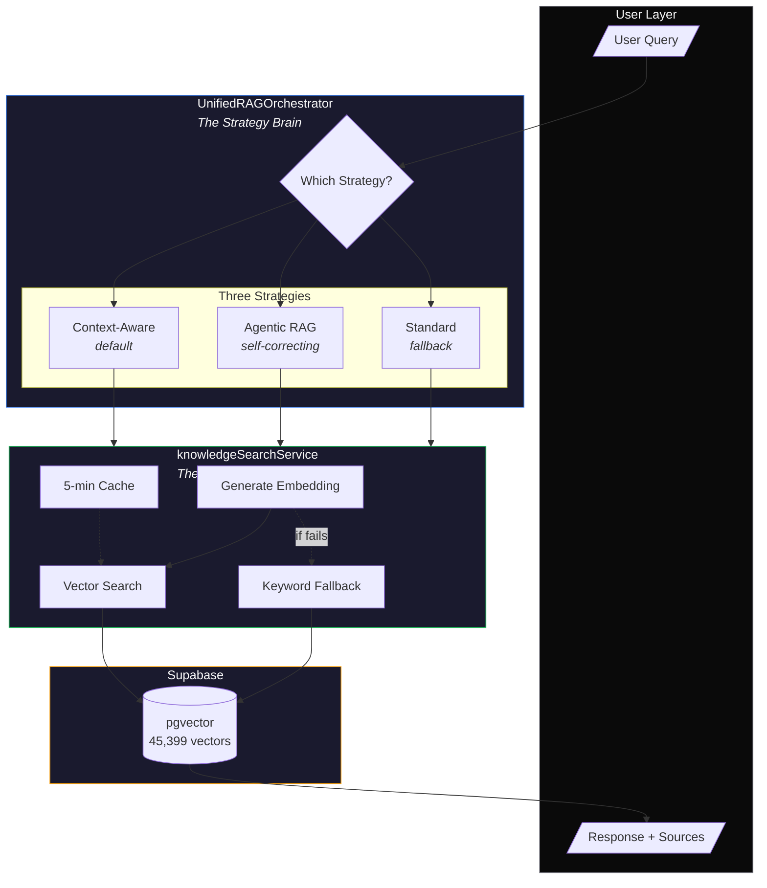
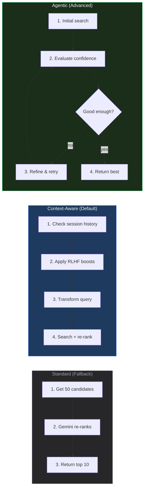
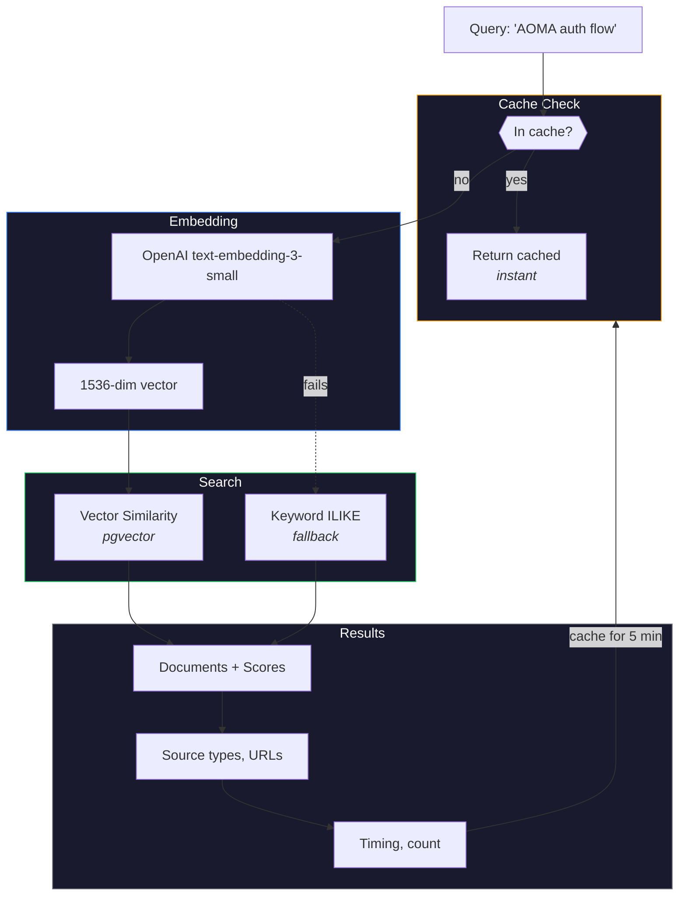
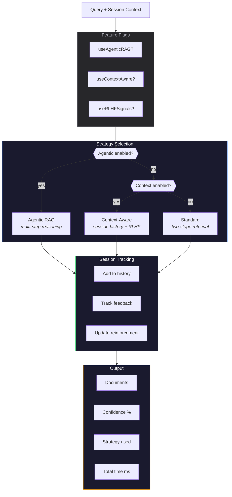
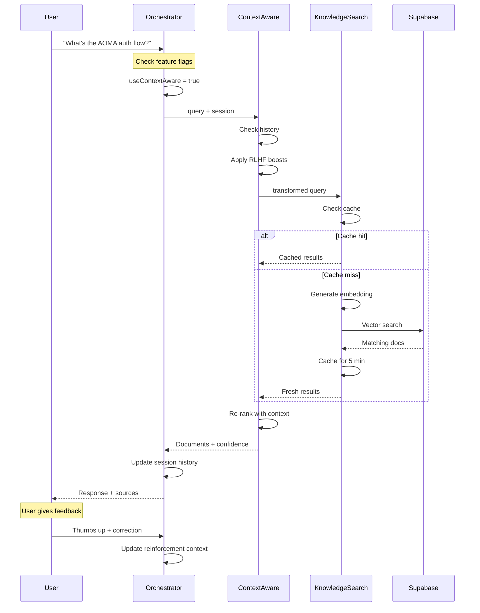

# RAG Architecture Visual Explainer

## The Big Picture



---

## The Three Strategies



---

## knowledgeSearchService Flow



---

## UnifiedRAGOrchestrator Flow



---

## RLHF Feedback Loop

```mermaid
flowchart LR
    subgraph QUERY["Query"]
        Q1["User asks question"]
    end

    subgraph RETRIEVE["Retrieve"]
        R1["Get documents"]
        R2["Show sources"]
    end

    subgraph RESPOND["Respond"]
        A1["Generate answer"]
        A2["Show citations"]
    end

    subgraph FEEDBACK["Feedback"]
        F1["Thumbs up/down"]
        F2["Star rating"]
        F3["Text correction"]
    end

    subgraph LEARN["Learn"]
        L1["Boost good docs"]
        L2["Demote bad docs"]
        L3["Adjust topic weights"]
    end

    Q1 --> R1 --> R2 --> A1 --> A2 --> F1
    F1 --> F2 --> F3
    F3 --> L1 --> L2 --> L3
    L3 -.->|"next query"| R1

    style QUERY fill:#1a1a2e,stroke:#71717a,color:#fafafa
    style RETRIEVE fill:#1a1a2e,stroke:#3b82f6,color:#fafafa
    style RESPOND fill:#1a1a2e,stroke:#22c55e,color:#fafafa
    style FEEDBACK fill:#1a1a2e,stroke:#f59e0b,color:#fafafa
    style LEARN fill:#1a1a2e,stroke:#ef4444,color:#fafafa
```



---

## Data Flow Summary



---

## Key Numbers

| Metric | Value |
|--------|-------|
| Total vectors | 45,399 |
| Embedding dims (OpenAI) | 1,536 |
| Embedding dims (Gemini) | 768 |
| Cache TTL | 5 minutes |
| Default top-K | 10 |
| Initial candidates | 50 |
| Match threshold | 0.50 |
| Query timeout | 3 seconds |

---

## TL;DR

```
┌─────────────────────────────────────────────────────────┐
│                                                         │
│   USER QUERY                                            │
│        │                                                │
│        ▼                                                │
│   ┌─────────────────────────────────────┐               │
│   │  UnifiedRAGOrchestrator             │               │
│   │  "Which strategy should I use?"     │               │
│   │                                     │               │
│   │  • Context-Aware (default)          │               │
│   │  • Agentic (self-correcting)        │               │
│   │  • Standard (fallback)              │               │
│   └─────────────────────────────────────┘               │
│        │                                                │
│        ▼                                                │
│   ┌─────────────────────────────────────┐               │
│   │  knowledgeSearchService             │               │
│   │  "Let me search the vectors"        │               │
│   │                                     │               │
│   │  • Generate embedding               │               │
│   │  • Vector similarity search         │               │
│   │  • Cache results                    │               │
│   └─────────────────────────────────────┘               │
│        │                                                │
│        ▼                                                │
│   ┌─────────────────────────────────────┐               │
│   │  Supabase pgvector                  │               │
│   │  45,399 domain-specific vectors     │               │
│   └─────────────────────────────────────┘               │
│                                                         │
└─────────────────────────────────────────────────────────┘
```

---

*These diagrams render in any Mermaid-compatible viewer (GitHub, VS Code, Obsidian, the SIAM app itself)*
