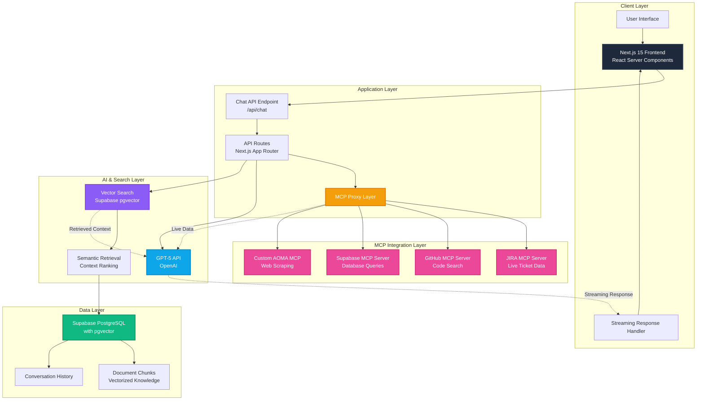

## Diagram 1: System Architecture

**Purpose:** Shows the complete system from UI to data layer

**Key Points to Highlight:**

- Next.js 15 with React Server Components for efficient rendering
- MCP Proxy Layer orchestrates multiple data sources
- GPT-5 receives context from both vector search AND MCP servers
- Streaming responses for real-time UX
- Supabase for both vector search and data storage

**Use in presentation:** "Here's the full architecture - notice how MCP servers provide live data alongside our vectorized knowledge base"
