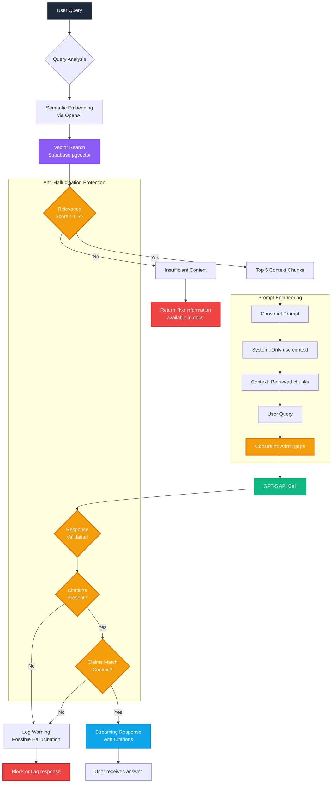

## Diagram 3: RAG Pipeline with Anti-Hallucination

**Purpose:** Shows the complete request flow with protection mechanisms

**Key Points to Highlight:**

**Query Processing:**
- Semantic embedding converts natural language to vectors
- pgvector finds similar content in knowledge base
- Relevance threshold (0.7) filters weak matches

**Protection Layers:**
1. **Relevance Score Check:** If score too low, immediately return "no information"
2. **Prompt Engineering:** Explicit instructions to only use provided context
3. **Response Validation:** Check for citations
4. **Claim Verification:** Ensure claims match context

**Use in presentation:** "We don't just throw docs at GPT and hope for the best - there are multiple protection layers"

**Technical Detail:** "Notice the early exit if relevance score is low - we'd rather say 'I don't know' than make something up"

**Demo Connection:** "This is why when I ask about blockchain features, the system correctly says there's no information rather than inventing features"
