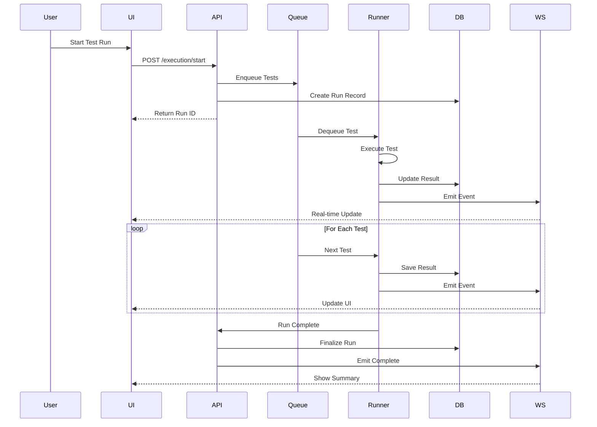
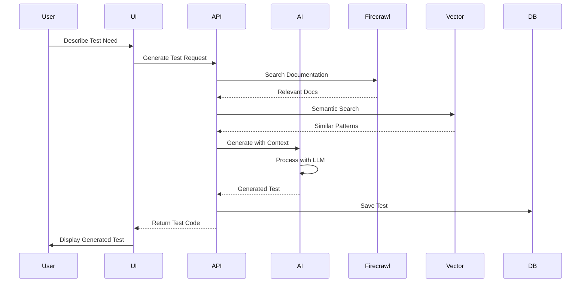

private io: Server;
private rooms: Map<string, Set<string>>;

constructor(server: HttpServer) {
this.io = new Server(server, {
cors: { origin: process.env.NEXT_PUBLIC_APP_URL },
transports: ['websocket', 'polling']
});

    this.rooms = new Map();
    this.setupEventHandlers();

}

private setupEventHandlers() {
this.io.on('connection', (socket) => {
console.log(`Client connected: ${socket.id}`);

      socket.on('subscribe', ({ channels }) => {
        channels.forEach(channel => {
          socket.join(channel);
          this.addToRoom(channel, socket.id);
        });
      });

      socket.on('disconnect', () => {
        this.removeFromAllRooms(socket.id);
      });
    });

}

// Broadcast test events
broadcastTestEvent(event: TestEvent) {
const channel = event.payload.runId;
this.io.to(channel).emit('test:event', event);

    // Also broadcast to global channel for dashboard overview
    this.io.to('global').emit('test:event', event);

}

// Send targeted messages
sendToClient(clientId: string, event: any) {
this.io.to(clientId).emit('direct:message', event);
}
}

// Client WebSocket Hook
function useTestWebSocket(runId: string) {
const [socket, setSocket] = useState<Socket | null>(null);
const [events, setEvents] = useState<TestEvent[]>([]);

useEffect(() => {
const newSocket = io(process.env.NEXT_PUBLIC_WS_URL, {
transports: ['websocket']
});

    newSocket.on('connect', () => {
      newSocket.emit('subscribe', { channels: [runId, 'global'] });
    });

    newSocket.on('test:event', (event: TestEvent) => {
      setEvents(prev => [...prev, event]);

      // Update Zustand store
      if (event.type === 'test:completed') {
        useTestStore.getState().actions.updateTestResult(event.payload);
      }
    });

    setSocket(newSocket);

    return () => {
      newSocket.close();
    };

}, [runId]);

return { socket, events };
}

````

#### Event Sourcing Pattern

```typescript
// Event Store Implementation
class TestEventStore {
  private events: TestEvent[] = [];
  private snapshots: Map<string, TestRunSnapshot> = new Map();

  async appendEvent(event: TestEvent): Promise<void> {
    // Store event
    this.events.push(event);

    // Persist to database
    await this.persistEvent(event);

    // Update aggregates
    await this.updateAggregates(event);

    // Broadcast via WebSocket
    this.broadcastEvent(event);
  }

  async getRunHistory(runId: string): Promise<TestEvent[]> {
    // Get snapshot if exists
    const snapshot = this.snapshots.get(runId);
    const fromTimestamp = snapshot?.timestamp || new Date(0);

    // Get events since snapshot
    const events = await this.loadEvents(runId, fromTimestamp);

    // Rebuild state from snapshot + events
    return this.rebuildState(snapshot, events);
  }

  private async createSnapshot(runId: string): Promise<void> {
    const state = await this.computeCurrentState(runId);
    this.snapshots.set(runId, {
      runId,
      state,
      timestamp: new Date(),
      version: 1
    });
  }
}
````

### Data Flow Architecture

#### Test Execution Flow



#### AI-Powered Test Generation Flow



### Caching Strategy

#### Multi-Layer Cache Architecture

```typescript
// Cache Layers
class CacheManager {
  private memoryCache: Map<string, CacheEntry>;
  private redisClient: Redis;
  private cacheConfig: CacheConfig;

  constructor() {
    this.memoryCache = new Map();
    this.redisClient = new Redis(process.env.REDIS_URL);
    this.cacheConfig = {
      memory: {
        maxSize: 100 * 1024 * 1024, // 100MB
        ttl: 60 * 1000, // 1 minute
      },
      redis: {
        ttl: 60 * 60, // 1 hour
        keyPrefix: "siam:test:",
      },
      cdn: {
        enabled: true,
        ttl: 24 * 60 * 60, // 24 hours
      },
    };
  }

  async get<T>(key: string): Promise<T | null> {
    // L1: Memory Cache
    const memoryHit = this.memoryCache.get(key);
    if (memoryHit && !this.isExpired(memoryHit)) {
      return memoryHit.value as T;
    }

    // L2: Redis Cache
    const redisKey = `${this.cacheConfig.redis.keyPrefix}${key}`;
    const redisHit = await this.redisClient.get(redisKey);
    if (redisHit) {
      const value = JSON.parse(redisHit);
      this.memoryCache.set(key, {
        value,
        timestamp: Date.now(),
        ttl: this.cacheConfig.memory.ttl,
      });
      return value as T;
    }

    return null;
  }

  async set<T>(key: string, value: T, ttl?: number): Promise<void> {
    // Set in memory
    this.memoryCache.set(key, {
      value,
      timestamp: Date.now(),
      ttl: ttl || this.cacheConfig.memory.ttl,
    });

    // Set in Redis
    const redisKey = `${this.cacheConfig.redis.keyPrefix}${key}`;
    await this.redisClient.setex(
      redisKey,
      ttl || this.cacheConfig.redis.ttl,
      JSON.stringify(value),
    );
  }

  async invalidate(pattern: string): Promise<void> {
    // Clear memory cache
    for (const [key] of this.memoryCache) {
      if (key.includes(pattern)) {
        this.memoryCache.delete(key);
      }
    }

    // Clear Redis cache
    const keys = await this.redisClient.keys(
      `${this.cacheConfig.redis.keyPrefix}*${pattern}*`,
    );
    if (keys.length > 0) {
      await this.redisClient.del(...keys);
    }
  }
}

// Cache Invalidation Strategy
class CacheInvalidator {
  private rules: InvalidationRule[] = [
    {
      event: "test:completed",
      invalidate: ["results:*", "coverage:*", "analytics:*"],
    },
    {
      event: "test:failed",
      invalidate: ["flakiness:*", "failures:*"],
    },
    {
      event: "ai:suggestion",
      invalidate: ["suggestions:*"],
    },
  ];

  async handleEvent(event: TestEvent): Promise<void> {
    const rule = this.rules.find((r) => r.event === event.type);
    if (rule) {
      for (const pattern of rule.invalidate) {
        await this.cacheManager.invalidate(pattern);
      }
    }
  }
}
```

### Security Architecture

#### Authentication & Authorization

```typescript
// Role-Based Access Control
enum Role {
  ADMIN = "admin",
  MANAGER = "manager",
  TESTER = "tester",
  VIEWER = "viewer",
}

enum Permission {
  // Test Execution
  RUN_TESTS = "run:tests",
  ABORT_TESTS = "abort:tests",

  // Test Management
  CREATE_TESTS = "create:tests",
  EDIT_TESTS = "edit:tests",
  DELETE_TESTS = "delete:tests",

  // Analytics
  VIEW_ANALYTICS = "view:analytics",
  EXPORT_REPORTS = "export:reports",

  // AI Features
  USE_AI_GENERATION = "ai:generate",
  USE_AI_HEALING = "ai:heal",

  // Admin
  MANAGE_USERS = "manage:users",
  MANAGE_SETTINGS = "manage:settings",
}

const rolePermissions: Record<Role, Permission[]> = {
  [Role.ADMIN]: [
    Permission.RUN_TESTS,
    Permission.ABORT_TESTS,
    Permission.CREATE_TESTS,
    Permission.EDIT_TESTS,
    Permission.DELETE_TESTS,
    Permission.VIEW_ANALYTICS,
    Permission.EXPORT_REPORTS,
    Permission.USE_AI_GENERATION,
    Permission.USE_AI_HEALING,
    Permission.MANAGE_USERS,
    Permission.MANAGE_SETTINGS,
  ],
  [Role.MANAGER]: [
    Permission.RUN_TESTS,
    Permission.ABORT_TESTS,
    Permission.CREATE_TESTS,
    Permission.EDIT_TESTS,
    Permission.VIEW_ANALYTICS,
    Permission.EXPORT_REPORTS,
    Permission.USE_AI_GENERATION,
    Permission.USE_AI_HEALING,
  ],
  [Role.TESTER]: [
    Permission.RUN_TESTS,
    Permission.CREATE_TESTS,
    Permission.EDIT_TESTS,
    Permission.VIEW_ANALYTICS,
    Permission.USE_AI_GENERATION,
  ],
  [Role.VIEWER]: [Permission.VIEW_ANALYTICS],
};

// Authorization Middleware
export function authorize(requiredPermission: Permission) {
  return async (req: Request, res: Response, next: NextFunction) => {
    const user = await getUserFromToken(req.headers.authorization);

    if (!user) {
      return res.status(401).json({ error: "Unauthorized" });
    }

    const userPermissions = rolePermissions[user.role];

    if (!userPermissions.includes(requiredPermission)) {
      return res.status(403).json({ error: "Insufficient permissions" });
    }

    req.user = user;
    next();
  };
}
```

#### Data Encryption

```typescript
// Encryption Service
class EncryptionService {
  private algorithm = "aes-256-gcm";
  private secretKey: Buffer;

  constructor() {
    this.secretKey = Buffer.from(process.env.ENCRYPTION_KEY, "hex");
  }

  encrypt(text: string): EncryptedData {
    const iv = crypto.randomBytes(16);
    const cipher = crypto.createCipheriv(this.algorithm, this.secretKey, iv);

    let encrypted = cipher.update(text, "utf8", "hex");
    encrypted += cipher.final("hex");

    const authTag = cipher.getAuthTag();

    return {
      encrypted,
      iv: iv.toString("hex"),
      authTag: authTag.toString("hex"),
    };
  }

  decrypt(data: EncryptedData): string {
    const decipher = crypto.createDecipheriv(
      this.algorithm,
      this.secretKey,
      Buffer.from(data.iv, "hex"),
    );

    decipher.setAuthTag(Buffer.from(data.authTag, "hex"));

    let decrypted = decipher.update(data.encrypted, "hex", "utf8");
    decrypted += decipher.final("utf8");

    return decrypted;
  }

  // Encrypt sensitive test data
  encryptTestCredentials(credentials: TestCredentials): string {
    const json = JSON.stringify(credentials);
    const encrypted = this.encrypt(json);
    return Buffer.from(JSON.stringify(encrypted)).toString("base64");
  }
}
```

### Performance Optimization

#### Query Optimization

```sql
-- Optimized query for test results with flakiness detection
WITH recent_runs AS (
  SELECT
    test_id,
    status,
    ROW_NUMBER() OVER (PARTITION BY test_id ORDER BY created_at DESC) as rn
  FROM test_results
  WHERE created_at > NOW() - INTERVAL '7 days'
),
flakiness_calc AS (
  SELECT
    test_id,
    COUNT(CASE WHEN status = 'passed' THEN 1 END) as passed,
    COUNT(CASE WHEN status = 'failed' THEN 1 END) as failed,
    COUNT(*) as total
  FROM recent_runs
  WHERE rn <= 10
  GROUP BY test_id
)
SELECT
  tr.*,
  fc.passed,
  fc.failed,
  fc.total,
  CASE
    WHEN fc.passed > 0 AND fc.failed > 0 THEN true
    ELSE false
  END as is_flaky,
  ROUND((fc.passed::DECIMAL / fc.total) * 100, 2) as pass_rate
FROM test_results tr
LEFT JOIN flakiness_calc fc ON tr.test_id = fc.test_id
WHERE tr.run_id = $1
ORDER BY tr.created_at DESC;

-- Index strategy for performance
CREATE INDEX CONCURRENTLY idx_test_results_composite
ON test_results(run_id, status, created_at DESC);

CREATE INDEX CONCURRENTLY idx_test_results_flaky
ON test_results(test_id, created_at DESC)
WHERE status IN ('passed', 'failed');
```

#### Request Batching

```typescript
// Batch API requests for efficiency
class BatchProcessor {
  private queue: Map<string, BatchRequest[]> = new Map();
  private timers: Map<string, NodeJS.Timeout> = new Map();
  private batchConfig = {
    maxSize: 100,
    maxWait: 50, // ms
  };

  async add<T>(endpoint: string, request: BatchRequest): Promise<T> {
    return new Promise((resolve, reject) => {
      // Add to queue
      if (!this.queue.has(endpoint)) {
        this.queue.set(endpoint, []);
      }

      this.queue.get(endpoint)!.push({
        ...request,
        resolve,
        reject,
      });

      // Check if should process immediately
      if (this.queue.get(endpoint)!.length >= this.batchConfig.maxSize) {
        this.processBatch(endpoint);
      } else {
        // Set timer for batch processing
        if (!this.timers.has(endpoint)) {
          const timer = setTimeout(() => {
            this.processBatch(endpoint);
          }, this.batchConfig.maxWait);

          this.timers.set(endpoint, timer);
        }
      }
    });
  }

  private async processBatch(endpoint: string): Promise<void> {
    const requests = this.queue.get(endpoint) || [];
    if (requests.length === 0) return;

    // Clear queue and timer
    this.queue.delete(endpoint);
    const timer = this.timers.get(endpoint);
    if (timer) {
      clearTimeout(timer);
      this.timers.delete(endpoint);
    }

    try {
      // Send batched request
      const response = await fetch(`/api/batch/${endpoint}`, {
        method: "POST",
        body: JSON.stringify({
          requests: requests.map((r) => r.data),
        }),
      });

      const results = await response.json();

      // Resolve individual promises
      requests.forEach((req, index) => {
        req.resolve(results[index]);
      });
    } catch (error) {
      // Reject all promises
      requests.forEach((req) => req.reject(error));
    }
  }
}
```

### Monitoring & Observability

#### Metrics Collection

```typescript
// Metrics Service
class MetricsCollector {
  private metrics: Map<string, Metric> = new Map();

  // Track test execution metrics
  recordTestExecution(test: TestResult): void {
    this.increment("tests.total");
    this.increment(`tests.${test.status}`);
    this.histogram("tests.duration", test.duration);

    if (test.flaky) {
      this.increment("tests.flaky");
    }

    this.gauge("tests.queue.size", this.getQueueSize());
  }

  // Track API performance
  recordApiCall(endpoint: string, duration: number, status: number): void {
    this.histogram(`api.${endpoint}.duration`, duration);
    this.increment(`api.${endpoint}.calls`);
    this.increment(`api.${endpoint}.status.${status}`);
  }

  // Track WebSocket connections
  recordWebSocketMetrics(connections: number, messages: number): void {
    this.gauge("websocket.connections", connections);
    this.counter("websocket.messages", messages);
  }

  // Export metrics for monitoring
  async export(): Promise<void> {
    const datadog = new DatadogClient();

    for (const [name, metric] of this.metrics) {
      await datadog.send({
        metric: name,
        points: metric.points,
        type: metric.type,
        tags: ["service:test-dashboard", `env:${process.env.NODE_ENV}`],
      });
    }
  }
}

// Distributed Tracing
class TracingService {
  private tracer: Tracer;

  constructor() {
    this.tracer = new Tracer({
      serviceName: "test-dashboard",
      agentHost: process.env.DD_AGENT_HOST,
    });
  }

  startSpan(name: string, parent?: Span): Span {
    return this.tracer.startSpan(name, {
      childOf: parent,
      tags: {
        "service.name": "test-dashboard",
        "resource.name": name,
      },
    });
  }

  // Trace test execution
  async traceTestExecution(testId: string, fn: Function): Promise<any> {
    const span = this.startSpan(`test.execution.${testId}`);

    try {
      const result = await fn();
      span.setTag("test.status", result.status);
      return result;
    } catch (error) {
      span.setTag("error", true);
      span.log({ event: "error", message: error.message });
      throw error;
    } finally {
      span.finish();
    }
  }
}
```

## Deployment Architecture

### Container Structure

```dockerfile
# Dockerfile for Test Dashboard
FROM node:20-alpine AS base

# Dependencies
FROM base AS deps
WORKDIR /app
COPY package*.json ./
RUN npm ci --only=production

# Builder
FROM base AS builder
WORKDIR /app
COPY package*.json ./
RUN npm ci
COPY . .
RUN npm run build

# Runner
FROM base AS runner
WORKDIR /app

ENV NODE_ENV production

COPY --from=builder /app/public ./public
COPY --from=builder /app/.next/standalone ./
COPY --from=builder /app/.next/static ./.next/static

EXPOSE 3000

CMD ["node", "server.js"]
```

### Infrastructure as Code

```yaml
# kubernetes/deployment.yaml
apiVersion: apps/v1
kind: Deployment
metadata:
  name: test-dashboard
  namespace: siam
spec:
  replicas: 3
  strategy:
    type: RollingUpdate
    rollingUpdate:
      maxSurge: 1
      maxUnavailable: 0
  selector:
    matchLabels:
      app: test-dashboard
  template:
    metadata:
      labels:
        app: test-dashboard
    spec:
      containers:
        - name: app
          image: siam/test-dashboard:latest
          ports:
            - containerPort: 3000
          env:
            - name: DATABASE_URL
              valueFrom:
                secretKeyRef:
                  name: supabase-secret
                  key: url
            - name: REDIS_URL
              valueFrom:
                secretKeyRef:
                  name: redis-secret
                  key: url
          resources:
            requests:
              memory: "512Mi"
              cpu: "250m"
            limits:
              memory: "1Gi"
              cpu: "500m"
          livenessProbe:
            httpGet:
              path: /api/health
              port: 3000
            initialDelaySeconds: 30
            periodSeconds: 10
          readinessProbe:
            httpGet:
              path: /api/ready
              port: 3000
            initialDelaySeconds: 5
            periodSeconds: 5
---
apiVersion: v1
kind: Service
metadata:
  name: test-dashboard-service
  namespace: siam
spec:
  selector:
    app: test-dashboard
  ports:
    - protocol: TCP
      port: 80
      targetPort: 3000
  type: LoadBalancer
---
apiVersion: autoscaling/v2
kind: HorizontalPodAutoscaler
metadata:
  name: test-dashboard-hpa
  namespace: siam
spec:
  scaleTargetRef:
    apiVersion: apps/v1
    kind: Deployment
    name: test-dashboard
  minReplicas: 3
  maxReplicas: 10
  metrics:
    - type: Resource
      resource:
        name: cpu
        target:
          type: Utilization
          averageUtilization: 70
    - type: Resource
      resource:
        name: memory
        target:
          type: Utilization
          averageUtilization: 80
```

## Disaster Recovery

### Backup Strategy

```typescript
// Automated Backup Service
class BackupService {
  async performBackup(): Promise<BackupResult> {
    const timestamp = new Date().toISOString();

    // Backup database
    const dbBackup = await this.backupDatabase(timestamp);

    // Backup test artifacts
    const artifactBackup = await this.backupArtifacts(timestamp);

    // Backup configuration
    const configBackup = await this.backupConfiguration(timestamp);

    // Verify backup integrity
    await this.verifyBackup({
      dbBackup,
      artifactBackup,
      configBackup,
    });

    return {
      id: `backup-${timestamp}`,
      timestamp,
      size: dbBackup.size + artifactBackup.size + configBackup.size,
      location: process.env.BACKUP_LOCATION,
    };
  }

  async restore(backupId: string): Promise<void> {
    // Restore in reverse order
    await this.restoreConfiguration(backupId);
    await this.restoreDatabase(backupId);
    await this.restoreArtifacts(backupId);

    // Verify restoration
    await this.verifyRestoration();
  }
}
```

---

**Document Version:** 1.0.0  
**Last Updated:** August 17, 2025  
**Next Review:** September 17, 2025
