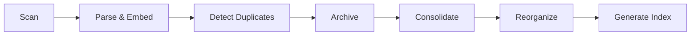

# External Knowledge Base Deduplication System

**Scope:** Only processes external scraped content from **AOMA**, **Confluence**, and **JIRA**.

## 🎯 What It Does

1. **Scans** external knowledge base documents
2. **Parses** with Docling & generates OpenAI embeddings  
3. **Detects** exact duplicates, near-duplicates, and similar content
4. **Archives** redundant documents with Git tracking
5. **Consolidates** similar documents using AI
6. **Reorganizes** by topic
7. **Generates** master index

## 📁 What Gets Processed

✅ **Included:**
- `aoma_crawl/` - Scraped AOMA pages (26 files)
- `confluence/` - Future Confluence content
- `jira/` - Future JIRA content

❌ **Excluded:**
- Internal SIAM project docs
- Config files
- Test results
- Implementation guides we wrote

## 🚀 Quick Start

### One-Command Deduplication

```bash
# Full deduplication with embeddings
npm run deduplicate

# Or directly:
./scripts/doc-analysis/deduplicate.sh
```

### Options

```bash
# Dry run (no changes)
./scripts/doc-analysis/deduplicate.sh --dry-run

# Skip OpenAI embeddings (faster, less accurate)
./scripts/doc-analysis/deduplicate.sh --skip-embeddings

# Only archive exact duplicates (skip similar docs)
./scripts/doc-analysis/deduplicate.sh --exact-only
```

## 📝 Individual Scripts

### 1. Scan Documents
```bash
npx ts-node scripts/doc-analysis/scan-documents.ts
```
Catalogs all documents and generates `document-inventory.json`

### 2. Parse & Embed
```bash
npx ts-node scripts/doc-analysis/parse-with-docling.ts \
  scripts/doc-analysis/document-inventory.json \
  scripts/doc-analysis/parsed-documents.json \
  --embeddings
```
Parses documents and generates OpenAI embeddings for similarity detection

### 3. Detect Duplicates
```bash
npx ts-node scripts/doc-analysis/detect-duplicates.ts \
  scripts/doc-analysis/document-inventory.json \
  scripts/doc-analysis/parsed-documents.json \
  scripts/doc-analysis/deduplication-report.json
```
Finds exact duplicates, near-duplicates, and outdated documents

### 4. Archive Duplicates
```bash
npx ts-node scripts/doc-analysis/archive-duplicates.ts \
  scripts/doc-analysis/deduplication-report.json \
  [--dry-run] [--exact-only]
```
Moves duplicates to `.archive/` with Git tracking

### 5. Consolidate Similar Docs
```bash
npx ts-node scripts/doc-analysis/consolidate-similar.ts \
  scripts/doc-analysis/deduplication-report.json \
  scripts/doc-analysis/parsed-documents.json \
  [--dry-run]
```
Uses AI to merge similar documents into comprehensive versions

### 6. Reorganize by Topic
```bash
npx ts-node scripts/doc-analysis/reorganize-by-topic.ts \
  scripts/doc-analysis/parsed-documents.json \
  scripts/doc-analysis/reorganization-plan.json
```
Generates topic-based organization plan

### 7. Generate Master Index
```bash
npx ts-node scripts/doc-analysis/generate-index.ts \
  scripts/doc-analysis/parsed-documents.json \
  scripts/doc-analysis/reorganization-plan.json \
  knowledge-base/INDEX.md
```
Creates hierarchical master index

## 📊 Output Files

| File | Description |
|------|-------------|
| `document-inventory.json` | Catalog of all documents |
| `parsed-documents.json` | Parsed content + embeddings |
| `deduplication-report.json` | Duplicate detection results |
| `reorganization-plan.json` | Topic-based reorg plan |
| `knowledge-base/INDEX.md` | Master index |
| `.archive/` | Archived duplicate files |

## 🔄 Workflow



## 🛡️ Safety Features

- **Dry Run Mode**: Test without making changes
- **Git Tracking**: All archives tracked in Git
- **Rollback Support**: Restore archived files
- **Scope Enforcement**: Only touches external content
- **Metadata Preservation**: Archives include original metadata

## 🔧 Requirements

- Node.js 18+
- Python 3.10+ with venv
- OpenAI API key (for embeddings & consolidation)
- Docling library (auto-installed in `.venv`)

## 📦 Installation

Already set up! If you need to reinstall:

```bash
# Recreate Python venv
python3 -m venv .venv
source .venv/bin/activate
pip install docling

# Install Node dependencies
npm install
```

## 💡 Tips

- Run `--dry-run` first to preview changes
- Check `deduplication-report.json` before archiving
- Use `--exact-only` for conservative deduplication
- Skip embeddings for faster runs (less accurate similarity)
- Review reorganization plan before applying

## 🚨 Troubleshooting

**Error: No documents found**
- Make sure `aoma_crawl/` directory exists
- Check that files aren't gitignored

**Error: OpenAI API**
- Verify `OPENAI_API_KEY` in `.env`
- Check API rate limits

**Error: Docling not found**
- Activate venv: `source .venv/bin/activate`
- Reinstall: `pip install docling`

## 📧 Support

For issues or questions, check the main SIAM project documentation.

---

**Remember:** This system ONLY processes external scraped content. It will never touch your internal project documentation! 💋

