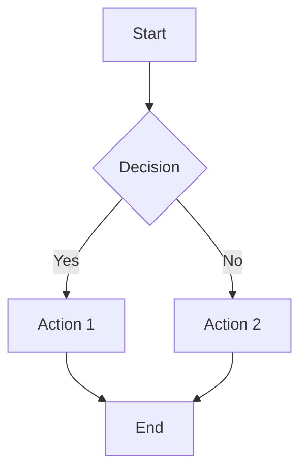
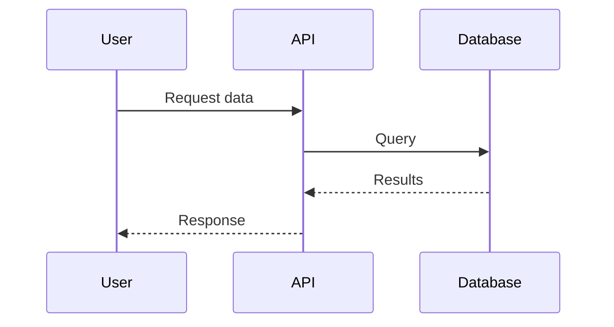

# Diagram Generation

When explaining workflows, architectures, multi-step processes, or system relationships, include a mermaid diagram to help visualize the concept.

**USE MERMAID DIAGRAMS FOR:**
- Workflow explanations (use `flowchart TB` or `flowchart LR`)
- Process steps (use `sequenceDiagram` for interactions)
- Architecture overviews (use `graph TD` for hierarchies)
- State machines and decision flows (use `stateDiagram-v2`)
- Data flow and pipelines (use `flowchart LR`)

**MERMAID SYNTAX EXAMPLES:**

**DO NOT ADD DIAGRAMS FOR:**
- Simple factual answers
- Short responses (less than 3 paragraphs)
- Questions you cannot answer ("I don't know" responses)
- Lists without relationships between items
- When the user asks for text-only response

**DIAGRAM STYLING:**
- Keep diagrams focused and readable (5-15 nodes maximum)
- Use descriptive labels on nodes and edges
- Group related items with subgraphs when appropriate
- Prefer vertical flow (TB) for processes, horizontal (LR) for timelines
