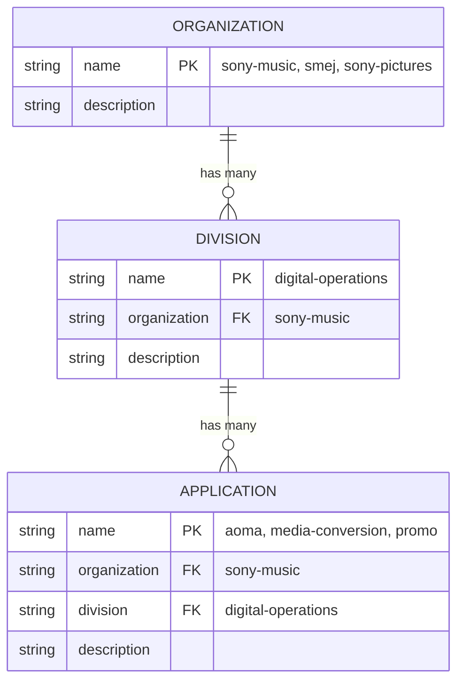

# Multi-Tenant ERD Preview

## Mermaid Diagram

## Structure:
- **ORGANIZATION**: Sony Music, SMEJ, Sony Pictures
- **SMEJ**: No divisions or apps (separate org, shows "...")
- **Sony Pictures**: No divisions or apps (separate org, shows "...")
- **Sony Music → Division**: Digital Operations
- **Digital Operations → Apps**: AOMA, Media Conversion, Promo

## NanoBanana Pro Layout:
When you say "fancy", the diagram will show:
- **Top row**: 3 cloud shapes (Sony Music, SMEJ, Sony Pictures)
- **Only Sony Music flows downward** to:
  - **Middle**: Digital Operations box
  - **Bottom**: 3 app boxes (AOMA, Media Conversion, Promo)
- SMEJ and Sony Pictures have "..." and no connections downward
