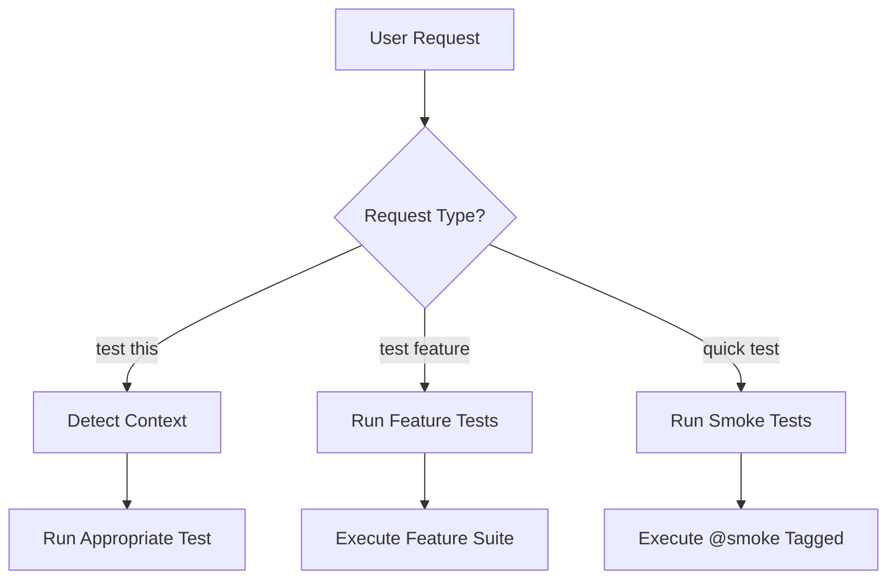

# 🎯 CLAUDE CODE TESTING INTEGRATION

## PRIORITY: This file is specifically for Claude Code (MCP)

### When using Claude Code, ALWAYS check this file first for testing guidance

## 📍 Quick Commands for Claude Code

```bash
# Claude Code should use these exact commands
claude> test              # Runs appropriate test based on context
claude> test chat         # Tests chat functionality
claude> test upload       # Tests file upload
claude> test smoke        # Runs critical path tests (2 min)
claude> test all          # Full test suite
claude> fix test          # Debugs and fixes failing test
```

## 🤖 Claude Code MCP Server Integration

### Testing through MCP
```typescript
// Claude Code can directly interact with tests via MCP
{
  "command": "run-test",
  "args": {
    "type": "smoke|regression|unit|integration|e2e",
    "feature": "chat|upload|auth",
    "file": "specific-test-file.test.ts"
  }
}
```

## 📁 File Structure Recognition

Claude Code should recognize this structure:
```
tests/
├── __TESTING_RULES__.md      ← START HERE ALWAYS
├── __CLAUDE_CODE__.md        ← THIS FILE
├── 01-unit/                  ← Fast tests (5s timeout)
├── 02-integration/           ← API tests (15s timeout)
├── 03-e2e/                   ← Browser tests (30s timeout)
├── __pages__/                ← Page Objects (REQUIRED)
└── __fixtures__/             ← Test Data Factories
```

## 🎨 Claude Code Testing Patterns

### 1. Creating a New Test
```typescript
// Claude Code should ALWAYS use this template
/**
 * @feature [FeatureName]
 * @claude-code-priority high|medium|low
 * @mcp-enabled true
 */
import { test, expect } from '@playwright/test';
import { [Feature]Page } from '../__pages__';
import { TestFactory } from '../__fixtures__';

test.describe('[FEATURE] [Name]', () => {
  // Test implementation
});
```

### 2. Running Tests via Claude Code
```bash
# Direct execution
npx playwright test tests/03-e2e/smoke/chat.e2e.test.ts

# With MCP integration
mcp run test --type=smoke --feature=chat

# Debug mode for Claude Code
DEBUG=pw:api npx playwright test --debug
```

### 3. Test Discovery Pattern
When Claude Code needs to find tests:
1. Check `__TESTING_RULES__.md` for patterns
2. Look in numbered directories by layer
3. Use `*.test.ts` or `*.spec.ts` pattern
4. Check tags: @smoke, @regression, @claude-code

## 🔧 Claude Code Specific Settings

### MCP Configuration
```json
{
  "claude-code": {
    "testing": {
      "defaultTimeout": 30000,
      "preferredRunner": "playwright",
      "autoFixTests": true,
      "pageObjectsPath": "tests/__pages__",
      "fixturesPath": "tests/__fixtures__"
    }
  }
}
```

### Environment Variables
```bash
# Claude Code should set these
export CLAUDE_CODE_TEST=true
export TEST_TIMEOUT=30000
export TEST_RETRIES=2
export TEST_WORKERS=1
```

## 🚀 Claude Code Quick Actions

| Action | Command | Description |
|--------|---------|-------------|
| Test Current File | `test:current` | Tests file in active editor |
| Test Related | `test:related` | Tests files related to changes |
| Test Changed | `test:changed` | Tests only modified files |
| Fix Selector | `test:fix-selector` | Updates broken selectors |
| Update Snapshot | `test:update-snapshot` | Updates visual snapshots |

## 📊 Test Execution Strategy for Claude Code



## 🎯 Claude Code Intelligence Rules

1. **Auto-detect test type** from file location
2. **Use Page Objects** - Never raw selectors
3. **Apply timeouts** based on test layer
4. **Generate reports** in `test-results/`
5. **Screenshot failures** to `screenshots/`

## 🔍 Selector Strategy for Claude Code

```typescript
// Priority order (Claude Code should follow)
1. testId:     '[data-testid="..."]'  // BEST
2. role:       '[role="..."]'         // GOOD
3. label:      '[aria-label="..."]'   // OK
4. text:       'text=...'             // FALLBACK
5. css:        '.class'               // AVOID
```

## 🐛 Debugging in Claude Code

```bash
# Enable debug mode
DEBUG=pw:api npx playwright test

# Use inspector
PWDEBUG=1 npx playwright test

# Headed mode for visual debugging
npx playwright test --headed

# Trace viewer for failures
npx playwright show-trace trace.zip
```

## ⚡ Performance Tips for Claude Code

1. Run unit tests first (fastest feedback)
2. Use `--grep @smoke` for quick validation
3. Parallelize integration tests
4. Run E2E tests sequentially
5. Cache test dependencies

## 🚫 Claude Code Must NEVER

- ❌ Create tests outside the organized structure
- ❌ Use hardcoded selectors in test files
- ❌ Mix test types (unit + e2e)
- ❌ Skip Page Object pattern
- ❌ Ignore timeout configurations

## ✅ Claude Code Must ALWAYS

- ✅ Read `__TESTING_RULES__.md` first
- ✅ Use Page Objects from `__pages__/`
- ✅ Generate data with `TestFactory`
- ✅ Follow naming: `[feature].[layer].test.ts`
- ✅ Tag tests appropriately
- ✅ Report results to `test-results/`

---
Last Updated: 2024
Priority: CRITICAL for Claude Code
